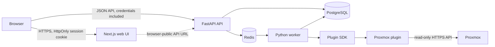

# Atlas architecture v0

## Purpose

Atlas is a customer/site-scoped infrastructure knowledge, documentation, and
topology platform. The same ownership and authorization model supports a
single-site homelab and a multi-customer MSP installation.

## Runtime architecture



PostgreSQL is the durable system of record. Redis carries operational job state;
it is not an authorization or inventory authority. The API owns all interactive
authentication, policy, validation, and scoped persistence. The browser is
untrusted, including customer/site IDs selected in the UI.

## Ownership hierarchy

```text
Atlas instance / workspace
└── Customer
    └── Site
        ├── Assets and interfaces
        ├── Networks
        └── Relationships between same-context assets
```

Every asset has a customer and site. New relationships require source and
target assets in the same customer/site. This gives a homelab a simple
`Home / Homelab` context while allowing an MSP operator to switch among many
authorized customers and sites.

## Main components

### Next.js web UI

The web UI provides login/profile/password management, a protected application
shell, customer/site context selection, inventory and topology, and
permission-aware administration. It does not persist authentication tokens in
browser storage. Navigation hiding improves usability but is not a security
control.

Only `NEXT_PUBLIC_API_URL` and development-origin configuration enter the web
container. Database, session-signing, and bootstrap secrets remain API-side.

### FastAPI API

The API owns:

- Database-backed authentication and session-version invalidation.
- Explicit permissions plus global/customer/site role assignments.
- Central scope policies for lists, individual objects, search, totals, and
  topology.
- Customer, site, network, asset, interface, and relationship validation.
- Managed asset/relationship types and their safe lifecycle.
- Typed custom-field definitions, applicability, options, and values.
- HTTPS icon URL validation and icon-resolution metadata.
- User, role, assignment, profile, and read-only audit APIs.
- Redacted, global-permission-only system settings.
- Integration, discovery, and documentation boundaries.

Application-data requests follow this order: authenticate, enforce
forced-password-change state, require a permission, resolve accessible
contexts, validate object ownership, then query or mutate. Authentication and
profile operations plus the slim, scope-filtered `/context` shell bootstrap are
the documented exceptions. FastAPI response models exclude password and
session material.

### PostgreSQL

PostgreSQL stores users, roles, permissions, assignments, customer/site-owned
inventory, managed reference data, enrichment values, integrations, discovery
runs, generated documents, and audit history. Foreign keys use restrictive
lifecycle behavior for customer/site/reference data so administration cannot
silently cascade-delete infrastructure history.

Schema changes use Alembic. Container startup migrates to `head` and runs
idempotent system seeding before the API accepts traffic. Upgrade and rollback
procedures are in [deployment-and-upgrades.md](deployment-and-upgrades.md).

### Worker and Redis

The worker boundary exists for discovery runs and document generation so remote
I/O does not execute in the API request lifecycle. A queued job must carry a
validated integration and customer/site context; a plugin must not choose its
own tenant or bypass core authorization.

The current worker orchestration remains intentionally limited. Operators
should not infer completed asynchronous scheduling merely because Redis and a
long-running worker container are present.

### Plugin SDK and Proxmox plugin

Plugins validate connections, collect raw vendor data, and normalize it into
vendor-neutral assets, facts, and relationships. Atlas core owns idempotent sync,
stable external identity, customer/site ownership, lifecycle, permissions, and
persistence. Plugins do not import Atlas database internals.

The Proxmox plugin uses read-only API-token authentication over HTTPS. TLS
verification is enabled by default. Secrets and authorization headers are not
returned in validation results or written to generated documentation.

## Managed reference and enrichment data

Asset and relationship types are global managed records in the MVP. Stable keys
preserve existing inventory when labels change. System-defined or referenced
types cannot be deleted; inactive types remain readable but are excluded from
new-record choices.

Custom fields are structured definitions and typed value rows. Global and
asset-type applicability share a maximum of 10 active rendered fields for any
asset type. Used definitions and options are deactivated rather than removed.

Icon URLs are metadata, not downloaded server-side content. Atlas accepts HTTPS
non-SVG URLs and resolves asset override, type default, then a generic fallback
in the browser.

## Audit and operational boundaries

The API appends audit events for authentication and administrative/security
changes, with safe summaries and optional request context. Audit access is
permission-gated and read-only through the application. Database administrators
remain inside the trust boundary; external append-only export is needed for
tamper-evident retention.

See
[authentication-and-access-control.md](authentication-and-access-control.md)
for the detailed security design and
[data-model-v0.md](data-model-v0.md) for entity relationships.
