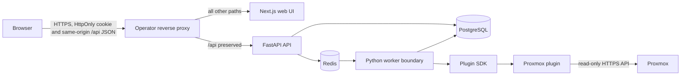

# Atlas architecture v0

Current baseline: implemented foundation through Release C2.1

## Purpose

Atlas is a customer/site-scoped infrastructure knowledge, documentation, and
topology platform. The same ownership and authorization model supports a
single-site homelab and a multi-customer MSP installation.

This document describes the implemented architecture baseline. Detailed Release
C2 graph architecture and extension boundaries are documented separately in
[`operational-graph.md`](operational-graph.md).

## Runtime architecture



PostgreSQL is the durable system of record. Redis is reserved for operational job
state; it is not an authorization, inventory, or knowledge authority. The API
owns all interactive authentication, policy, validation, accepted knowledge,
and scoped persistence. The browser is untrusted, including customer/site IDs
selected in the UI.

The worker and plugin components exist, but configured Integration management,
secret resolution, queued dispatch, retry/cancellation, and end-to-end live
plugin execution remain partial. The usable discovery product currently includes
simulation, evidence, assertions, reconciliation, and independently tested plugin
and sync components.

Atlas deliberately validates the knowledge, Service, relationship, and graph
models with manually entered and curated accepted knowledge. C2.1 is complete;
B2-lite live Proxmox discovery is a later Homelab Ready increment and must
preserve the observed-versus-accepted boundary.

## Ownership hierarchy

```text
Atlas instance / workspace
└── Customer
    ├── Site
    │   ├── Assets and interfaces
    │   ├── Networks
    │   └── Relationships between same-context Assets
    ├── Services
    │   ├── customer-wide or Site-scoped
    │   ├── Service-to-Asset dependencies
    │   └── Service-to-Service dependencies
    └── Business Functions
        └── customer-wide or Site-scoped links from Services
```

Every Asset has a customer and site. New Asset relationships require source and
target Assets in the same customer/site. This gives a homelab a simple
`Home / Homelab` context while allowing an MSP operator to switch among many
authorized customers and sites.

Services and Business Functions belong to a customer and may be customer-wide or
site-scoped according to their model rules. Their links must remain compatible
with the Service and target scope and are independently authorized by the API.

## Main components

### Next.js web UI

The web UI provides:

- login, profile, password management, and logout;
- a protected application shell;
- customer/site context selection;
- inventory, networks, Services, Business Functions, and topology;
- discovery simulation, run history, reconciliation, changes, and knowledge
  gaps;
- focused Service and Business Function graphs;
- permission-aware administration; and
- user appearance preferences.

The browser does not persist authentication tokens in browser storage.
Navigation hiding improves usability but is not a security control.

The sidebar uses stable Overview, Knowledge, Operations, Connections, and System
domains, with Profile kept separate. The topology route is labelled Knowledge
Graph and discovery-run activity is labelled Discovery. Roadmap entries remain
disabled in the declarative navigation model until a usable route exists.

The browser API base defaults to `/api`; `NEXT_PUBLIC_API_URL` is an optional
split-origin development override. Only browser-public configuration enters the
web container. Database, session-signing, bootstrap, and Integration secrets
remain API/worker-side.

### FastAPI API

The API owns:

- database-backed authentication and session-version invalidation;
- explicit permissions plus global/customer/site role assignments;
- central scope policies for lists, individual objects, search, totals, graphs,
  and topology;
- customer, site, network, Asset, interface, and relationship validation;
- managed Asset/Relationship Types and safe lifecycle behavior;
- typed custom-field definitions, applicability, options, and values;
- HTTPS icon URL validation and icon-resolution metadata;
- user, role, assignment, profile, and read-only audit APIs;
- redacted, global-permission-only system settings;
- data sources, discovery simulation, assertions, reconciliation, and changes;
- completeness requirements, summaries, and knowledge-gap workflows;
- first-class Services, Service reference data, temporal dependencies, Business
  Functions, provenance, and focused graphs; and
- Integration, worker, plugin, and generated-document boundaries.

Application-data requests follow this order: authenticate, enforce
forced-password-change state, require a permission, resolve accessible contexts,
validate object ownership, then query or mutate. Authentication and profile
operations plus the slim, scope-filtered `/api/context` shell bootstrap are the
documented exceptions. FastAPI response models exclude password and session
material.

### PostgreSQL

PostgreSQL stores:

- users, roles, permissions, and scoped assignments;
- Customers, Sites, Assets, interfaces, Networks, and Asset relationships;
- managed reference data and typed enrichment values;
- data sources, discovery runs, evidence, assertions, entity-source links,
  reconciliation items, observation coverage, and knowledge changes;
- knowledge requirement definitions, gaps, and current summaries;
- Services, Service Types, Criticality Levels, temporal Service dependencies,
  Business Functions, and Service-to-Business Function links;
- Integration metadata;
- generated documents; and
- audit history.

Foreign keys use restrictive lifecycle behavior for customer/site/reference data
so administration cannot silently cascade-delete infrastructure or knowledge
history.

Schema changes use Alembic. Container startup migrates to `head` and runs
idempotent system seeding before the API accepts traffic. Upgrade and rollback
procedures are in [`deployment-and-upgrades.md`](deployment-and-upgrades.md).

### Worker and Redis

The worker boundary exists for discovery runs and document generation so remote
I/O does not execute in the API request lifecycle. A queued job must carry a
validated Integration and customer/site context; a plugin must not choose its
own tenant or bypass core authorization.

The current worker orchestration remains intentionally limited. Operators must
not infer completed asynchronous scheduling merely because Redis and a
long-running worker container are present.

Future worker completion must add explicit service identity, secret-reference
resolution, API-authorized job envelopes, dispatch, status, retries,
cancellation, and freshness without changing the accepted-knowledge and
reconciliation boundaries.

### Plugin SDK and Proxmox plugin

Plugins validate connections, collect raw vendor data, and normalize it into
vendor-neutral Assets, facts, and relationships. Atlas core owns idempotent sync,
stable external identity, customer/site ownership, lifecycle, permissions,
reconciliation, and persistence. Plugins do not import Atlas database internals.

The Proxmox plugin uses read-only API-token authentication over HTTPS. TLS
verification is enabled by default. Secrets and authorization headers are not
returned in validation results or written to generated documentation.

### Knowledge and reconciliation services

Atlas keeps related knowledge concepts separate:

- immutable evidence records;
- sourced assertions with source-current and accepted states;
- reconciliation items requiring human decisions;
- accepted operational records used by inventory and graphs;
- meaningful Knowledge Changes for product history; and
- Knowledge Gaps for absent, stale, or insufficient knowledge.

A discovery observation does not silently overwrite accepted knowledge. Manual
accepted edits create declared assertions and meaningful changes. Complete
snapshot absence detection creates reviewable lifecycle items rather than
deleting Assets.

See
[`knowledge-changes-and-reconciliation.md`](knowledge-changes-and-reconciliation.md).

### Knowledge completeness

The deterministic completeness evaluator uses database-defined structured rules,
opens or resolves lifecycle-preserving gaps, and maintains current summary rows.
Evaluator failure must not roll back a valid operational edit or create false
completeness.

The implemented evaluators support Assets and Services. The generic boundary
prepares for later Business Function, ownership, recovery, and Knowledge Object
coverage.

See [`knowledge-completeness.md`](knowledge-completeness.md).

### Services and Business Functions

A Service is an operational capability; an Asset is a technical implementation,
host, connection, or protection component. C1 keeps these concepts separate.

Services include purpose, criticality, lifecycle and operational status,
plain-text owner/contact/support labels, documentation and runbook links, exact
minute RTO/RPO values, backup/recovery notes, assertions, changes, and
completeness.

Temporal links model:

- Service to Asset;
- Service to Service; and
- Service to Business Function.

Legitimate cycles between different Services are allowed. Ending a link records
`valid_to`, retracts the active assertion as appropriate, and preserves history.

Current focused graph endpoints are useful bounded projections, not recursive
impact analysis.

See [`service-model.md`](service-model.md) and
[`service-dependencies.md`](service-dependencies.md).

## Managed reference and enrichment data

Asset and Relationship Types are global managed records in the current MVP.
Stable keys preserve existing inventory when labels change. System-defined or
referenced types cannot be deleted; inactive types remain readable but are
excluded from new-record choices.

Relationship Type applicability includes typed endpoint pairs used by Asset and
Service dependency APIs. The API validates applicable active types rather than
allowing the UI to invent relationship meaning.

Custom fields are structured definitions and typed value rows. Global and
Asset-Type applicability share a maximum of 10 active rendered fields for any
Asset Type. Used definitions and options are deactivated rather than removed.

Icon URLs are metadata, not downloaded server-side content. Atlas accepts HTTPS
non-SVG URLs and resolves Asset override, type default, then a generic fallback
in the browser.

## Graph architecture at the C2.1 baseline

Atlas has three related graph surfaces:

1. **Knowledge Graph topology lenses** over scoped Assets, interfaces, Networks,
   and Asset relationships.
2. **Focused Service/Business Function projections** adapted from the shared
   operational graph builder.
3. **Generic operational graph projection** focused on an authorized Asset,
   Service, or Business Function with typed identity, explicit direction,
   bounded depth, deterministic ordering, cycle safety, current-valid temporal
   filtering, edge-family filters, and safe truncation.

The public focused graph schemas retain their C1 UUID contracts, while the
shared C2.1 contract uses namespaced node and edge identity. The API applies
endpoint-by-endpoint authorization and non-disclosure. These graphs remain
structural: they intentionally avoid dependency-effect evaluation, outage
simulation, recovery selection, and planned-change overlays.

C2.1 remains separate from B2-lite Integration/Proxmox completion, the F1-lite
Documents surface, Interface-first IP cleanup, and legacy Service Asset
conversion. See
[`operational-graph.md`](operational-graph.md) and
[`../decisions/0001-shared-operational-graph.md`](../decisions/0001-shared-operational-graph.md).

## Audit and operational boundaries

The API appends Audit Events for authentication and administrative/security
changes, with safe summaries and optional request context. Audit access is
permission-gated and read-only through the application. Database administrators
remain inside the trust boundary; external append-only export is needed for
tamper-evident retention.

Knowledge Changes are separate product events and must not be used as a security
audit substitute.

See
[`authentication-and-access-control.md`](authentication-and-access-control.md)
for the detailed security design and [`data-model-v0.md`](data-model-v0.md) for
the detailed entity model.

## Planned architecture evolution

The roadmap preserves this baseline and adds capabilities in layers:

- C2.1 shared operational graph (implemented);
- C2.2 lean dependency semantics;
- C2.3 explainable dependency analysis;
- C2.4 Homelab Operations Experience;
- F1-lite Homelab Documentation and B2-lite Live Proxmox Discovery;
- Homelab Ready hardening and release;
- C3 structured People/Team ownership and C4 formal Knowledge Objects after
  Homelab Ready;
- D recovery knowledge and evidence;
- E failure and recovery-aware impact analysis; and
- F intended state, change simulation, and post-change reconciliation.

Planned features must remain labelled as planned until the repository code,
migrations, tests, and feature ledger establish implementation.
