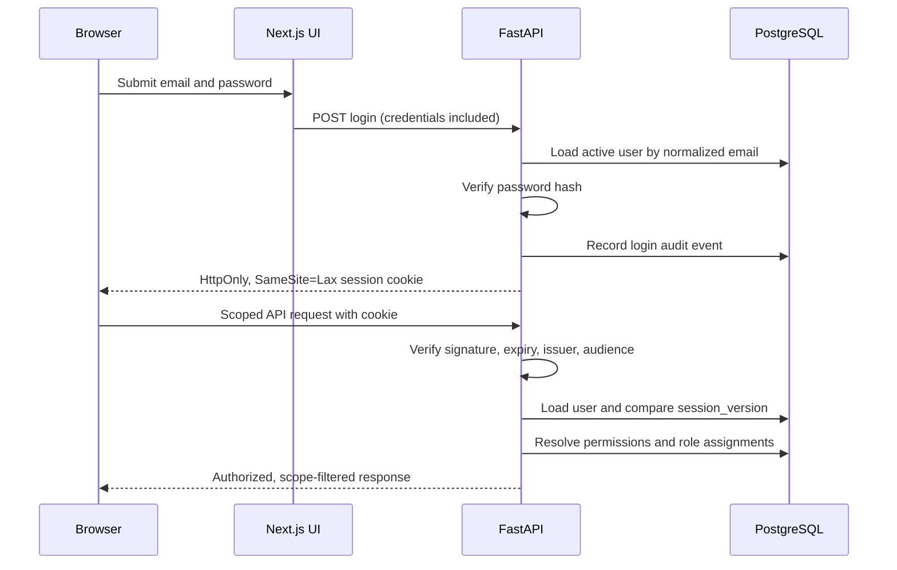

# Authentication, access control, and administration

This document defines the Atlas MVP security boundary. It is the implementation
contract for database-backed users, explicit permissions, customer/site scope,
administrative reference data, and audit history.

## Trust boundaries

The browser is an untrusted client. A hidden navigation item, selected customer,
route parameter, object ID, count filter, or submitted role is never evidence of
authorization. FastAPI authenticates the request and applies permission, scope,
and object-context checks before querying or mutating PostgreSQL.

PostgreSQL is the durable authority for users, roles, permissions, assignments,
inventory ownership, managed types, custom fields, session versions, and audit
events. Redis and the worker do not grant user access. Discovery and background
jobs must carry a trusted actor/service identity and customer/site context before
they can write scoped records.

## Authentication flow

Passwords are hashed with the password library's current recommended algorithm
and are never returned or logged. Unknown-user login attempts still perform a
dummy hash verification to reduce account-enumeration timing differences.

The browser session is an expiring signed value stored only in the
`atlas_session` cookie. The cookie is `HttpOnly`, `SameSite=Lax`, scoped to `/`,
and `Secure` when `AUTH_COOKIE_SECURE=true`. Browser requests use credentials;
the web application does not copy a bearer token into `localStorage`, React
state, logs, or URLs.

The session contains the user's session-version claim. Authentication reloads
the user and rejects a disabled account or a version mismatch. Logout and a
successful password change increment `users.session_version`, so previously
issued sessions for that account stop working even if their signed expiry has
not passed. Rotating `AUTH_SECRET_KEY` invalidates every signed session.

An account marked `force_password_change` is restricted to `/api/auth/me`, profile,
password-change, logout, and the read-only `/api/context` selector until the
password is replaced. The selector exposes only authorized customer/site IDs,
names, and statuses so the protected shell can initialize the password-change
page; it does not expose inventory or administrative records. All
permission-protected application routes continue to return `403`. A profile
update can change `display_name`; it cannot change email, roles, scopes, active
state, or session version through mass assignment.

## Bootstrap administrator

`scripts.seed_admin` is an idempotent first-user bootstrap, not a recurring
credential seed:

1. If any user exists, exit successfully without changing users, passwords,
   roles, or assignments.
2. If the users table is empty and all bootstrap values are absent, exit
   successfully without creating an account.
3. If only some values are present, or a value fails email/password/name
   validation, fail with a safe configuration error.
4. If the table is empty and all values are valid, create one active user with a
   password hash and `force_password_change=true`.
5. Ensure the protected Master Administrator role exists and assign it globally
   to the new user.
6. If no customer exists, create the starter `Home / Homelab` context; never add
   it to an installation that already has customer data.

The variables are `ATLAS_BOOTSTRAP_ADMIN_EMAIL`,
`ATLAS_BOOTSTRAP_ADMIN_PASSWORD`, and `ATLAS_BOOTSTRAP_ADMIN_NAME`. Operators
remove them after the first password change. They never overwrite a password
and cannot be used to recover an existing account.

For upgrade compatibility, the deprecated `ATLAS_ADMIN_EMAIL`,
`ATLAS_ADMIN_PASSWORD`, and `ATLAS_ADMIN_DISPLAY_NAME` group is consulted only
when the users table is empty and the preferred group is absent. It emits a
warning and enters the exact same one-time flow. Existing users cause an early
no-op before either group is interpreted, so a stale environment password is
never a live credential or reset path.

System permissions, built-in roles, and managed system types are seeded
idempotently and separately from this one-time user bootstrap. Startup may add a
missing protected definition introduced by a release, but does not overwrite
operator-editable records.

## Permissions and role assignments

A `Permission` is a stable action key such as `assets.view` or
`users.assign_roles`. A `Role` groups permissions. Authorization code asks for
permission keys rather than granting behavior because a role has a particular
display name.

The protected built-in roles are:

- **Master Administrator**: every permission. A usable master assignment is
  global.
- **Administrator**: broad administrative and operational permissions, subject
  to its assigned scope; Master-only platform controls are not implicit.
- **Customer Administrator**: write access to inventory and permitted metadata
  inside assigned customers/sites, without cross-customer access.
- **Viewer**: read-only access inside assigned scope.

A role assignment joins a user and role to exactly one scope:

- `global`: all customers and sites in this Atlas instance.
- `customer`: the named customer and its sites.
- `site`: the named site, whose parent customer must match the assignment.

This lets one user be a Customer Administrator for one customer and a Viewer at
another site without combining role names and tenancy. A permission is effective
only when at least one active assignment grants the key and covers the target
context.

For a request requiring permission `P` over customer `C` and optional site `S`,
the central policy layer performs this sequence:

1. Authenticate an active user and enforce forced-password-change state.
2. Load assignments whose role grants `P`.
3. Match a global assignment, a customer assignment for `C`, or a site
   assignment for `S`.
4. Validate that submitted site/customer IDs are a real parent-child pair.
5. Load or mutate only objects covered by the matched context.

List, search, dashboard totals, topology, and selector queries build their SQL
filters from the same accessible customer/site set. They do not fetch all rows
and filter them in the browser. An authenticated user with the wrong permission
or scope receives `403`; APIs may return `404` instead when that better avoids
revealing an inaccessible object's existence.

Built-in roles and permissions cannot be deleted through ordinary
administration. User-management invariants prevent disabling, demoting, or
removing the assignment of the final active global Master Administrator.

## Active customer and site context

The context provider obtains the current user's accessible customers and sites
from the API. It persists only IDs as a UI preference; persisted IDs confer no
access. On login and navigation it applies these rules:

- Reject a selected customer/site that is not in the fresh accessible set.
- Clear a site when its customer changes, then show only sites under that
  customer.
- Restore one valid Customer/Site preference, otherwise choose the first
  accessible Customer/Site in deterministic API order.
- Do not expose All Customers or All Sites in the workspace selectors.
- Require a concrete authorized customer and site for creation.

The selected `Customer / Site` is displayed in the protected header. Asset,
relationship, topology, network, and dashboard queries include that context.
Asset creation defaults to it, but the API independently validates submitted
ownership. The web client sends the preference as `X-Atlas-Customer-ID` and
`X-Atlas-Site-ID`; the central context dependency rejects a mismatched site,
stale ID, or scope the current assignments do not cover.

C2.4 treats the selected Site as a viewpoint for opt-in graph/analysis reads.
It retains the selected Customer and per-entity/per-edge permissions, and can
include directly relevant authorized cross-site providers of customer-wide
Services. This does not widen any assignment. Customer-wide form mutations
explicitly send record scope so the viewpoint does not change record ownership.
See [the operations architecture](homelab-operations-experience.md).

Every asset belongs to one customer and one site. New relationships are allowed
only when the source and target are both authorized and have the same customer
and site. The migration retains a legacy cross-context relationship to avoid
data loss and marks it `legacy_cross_context`; a user can read that edge only
when both endpoints are accessible, and it cannot be recreated or edited into
another cross-context edge.

## Administration boundaries

Administration routes use the same policy layer as inventory routes:

- User APIs return safe identity/profile fields and assignment summaries, never
  password hashes. Temporary passwords are write-only and require a change on
  next login.
- An authenticated user can update only their own display name and accent
  colour through `/api/auth/profile`. Accent values are restricted to a single
  six-digit hex colour, normalized to uppercase, and never interpolated into
  raw CSS; `null` resets the account to the Atlas default. Administrators do not
  receive a separate accent-management path for other users.
- Role and permission APIs expose built-in mappings. Protected records and the
  last-master invariant cannot be bypassed with direct IDs.
- Customer/site deletion is allowed only when no dependent records would be
  orphaned. Used records are deactivated instead of cascaded away.
- Audit APIs are read-only and require `audit.view`.
- Sensitive system-setting values are redacted on read, require global
  `system_settings.manage` to change, and produce a safe audit summary.

## Managed types and lifecycle

Asset and relationship types are global reference data in the MVP. Their
stable `key` is stored by existing inventory and does not change when an
administrator edits the display name. A type can be deleted only when it is
neither system-defined nor referenced. A referenced or retired type can be
deactivated: it remains resolvable on old records but is absent from creation
choices.

Relationships also store directionality and source/target/inverse labels. New
relationships must use an active type. Optional source/target applicability can
further constrain valid endpoint asset types.

## Custom fields

Custom fields use definitions, optional dropdown choices, applicability rows,
and typed per-asset values rather than arbitrary columns or an unvalidated JSON
bag. The supported MVP types are single-line text, multiline text, number, date,
boolean, absolute HTTP/HTTPS URL, and dropdown.

A global definition applies to every asset type. Type-specific applicability
adds selected asset types. Before activating or changing applicability, the API
calculates the full active set for every affected asset type; global fields count
toward the maximum of 10. Required fields and values are validated server-side.
Keys cannot change after values exist, incompatible type changes are rejected,
and a used definition or dropdown option is deactivated rather than
destructively removed. Existing values remain readable when a definition is
inactive.

## Icon safety

Asset icon URLs are external sources for the [secure local icon cache](asset-icon-cache.md).
An authenticated, Asset-scoped endpoint serves validated raster images from
PostgreSQL. Resolution is cached Asset image, then Asset Type default, then the
generic icon. Public HTTPS/DNS/peer/redirect validation, download and decoding
limits protect the server fetch boundary. URL changes refresh lazily; successful
unchanged sources are never periodically refreshed. Asset Type defaults retain
the existing browser HTTPS behavior. Remote SVG is not supported.

## Audit events

Security-sensitive and administrative operations append a durable event with
the actor ID and identity snapshot, action, entity type/ID, optional
customer/site, timestamp, result, safe change summary, and available request
metadata/correlation ID. Login failures omit the submitted password and do not
need a user ID.

Audit serializers and change-summary builders explicitly exclude credentials,
hashes, cookies, signed sessions, secret keys, and full sensitive request
bodies. There is no ordinary update or delete API for audit rows. Database
operators still control the database, so deployments requiring tamper-evident
retention should export events to an external append-only system.

## Security limitations and future extensions

This MVP provides local password authentication, scoped RBAC, guarded reference
data, and an application audit trail. It does not yet provide SSO/OIDC/SAML,
MFA, recovery codes, a self-service forgotten-password email flow, per-session
device management, or tamper-evident external audit retention. Role,
assignment, and user identity tables leave room for an external issuer/subject
and MFA state without changing inventory ownership.

`SameSite=Lax`, a narrow credentialed CORS allow-list, and rejection of an
unapproved `Origin` on state-changing requests are the current browser
request-forgery controls; a deployment that must support cross-site embedding
or cross-site cookies needs an explicit CSRF-token design before relaxing them.
Production must use HTTPS and secure cookies.
Rate limiting and edge protections should be supplied by the reverse proxy until
distributed login throttling is implemented.

Customer-specific managed types/custom-field definitions, cross-site
relationships, plugin-defined permissions, and uploaded icon storage are
deliberately deferred. Adding them must preserve the central permission/scope
policy rather than introducing route-specific trust shortcuts.
