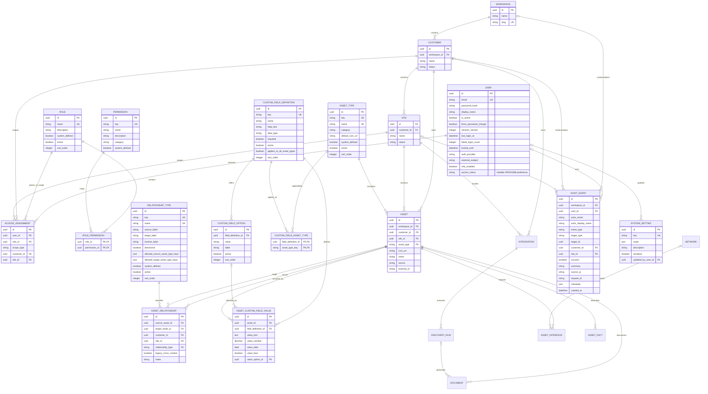

# Atlas data model v0

## Entity relationships

`AccessAssignment` is both the role-assignment and access-scope-assignment
concept: one row links a user and role to one global, customer, or site scope.
Keeping permission membership in `RolePermission` and scope on the assignment
allows the same user to hold different roles in different contexts.

## Identity and access

### User

`User` is the database identity for local login. Email is the normalized unique
login identifier. `password_hash` is write-only outside the authentication
layer. Active/lock fields gate login, `force_password_change` gates normal API
use, and `session_version` invalidates already-issued signed sessions.

`auth_provider`, `external_subject`, and `mfa_enabled` are extension points; this
release implements local passwords, not external identity or MFA.
`accent_colour` is a nullable, per-user presentation preference stored as a
canonical uppercase `#RRGGBB` value. A null value selects the Atlas default
theme and preserves the existing appearance for upgraded accounts.

### Role, Permission, and AccessAssignment

Permissions have stable keys. Roles group them through `RolePermission`.
Protected built-in roles and system permissions are seeded idempotently.

The assignment scope constraint is:

| `scope_type` | `customer_id` | `site_id` | Meaning |
| --- | --- | --- | --- |
| `global` | null | null | Role permissions apply instance-wide. |
| `customer` | set | null | Apply to the customer and its sites. |
| `site` | set | set | Apply only to that site; the composite foreign key proves it belongs to the customer. |

Partial unique indexes prevent duplicate user/role assignments at each scope.
Deleting a user removes its assignments. Roles and scoped customer/site records
use restrictive references so assignments must be reviewed explicitly.

## Ownership and inventory

### Workspace, Customer, and Site

`Workspace` remains the instance-level container used by the existing model.
Customer names are unique within a workspace. Site names are unique within a
customer, and `(customer_id, site_id)` is a candidate key used by composite
ownership constraints.

Customer/site records use active/inactive status. A record with dependants is
not silently cascade-deleted.

### Asset and AssetRelationship

Every asset has a non-null customer and site, with a composite foreign key that
proves the site belongs to its customer. `asset_type` references the stable
`AssetType.key`; the nullable `icon_url` is the asset override.

A new relationship stores its customer/site context and stable relationship
type key. Both source and target must be distinct, accessible assets. New edges
must have endpoints in the same customer/site. A retained legacy cross-context
edge has `legacy_cross_context=true` and is treated as historical compatibility
data: authorization requires both endpoints, and mutation cannot create another
cross-context edge. Its stored relationship context is copied from the source
asset during migration; endpoint authorization remains authoritative for reads.

Interfaces, facts, and documents depend on their asset. Every integration
belongs to exactly one customer and one site, with a composite foreign key that
proves the site belongs to that customer; discovery runs belong to an
integration. Core sync derives ownership from the validated integration/run
context rather than accepting plugin-selected tenancy.

## Managed reference data

### AssetType

The UUID `id` is the internal primary key; the unique string `key` is the stable
inventory reference used by assets. Display name, description, category,
default icon URL, active state, and sort order are editable subject to policy. A
system-defined or referenced type cannot be deleted; inactive types remain
resolvable for existing assets.

### RelationshipType

Relationship types similarly have an internal UUID and a stable unique key.
Labels, inverse label,
directionality, and optional allowed source/target asset-type key lists drive
validation and display. Used/system types follow the same delete-versus-
deactivate lifecycle.

## Custom fields

`CustomFieldDefinition` holds the stable key, type, requirement, order, and
global-applicability flag. `CustomFieldAssetType` is the many-to-many
applicability table for selected asset types. The service counts global plus
specific active definitions and rejects a configuration above 10 for any asset
type.

Dropdown definitions own ordered `CustomFieldOption` rows. Used options are
deactivated rather than removed. `AssetCustomFieldValue` has one row per
asset/definition and exactly one populated typed column. Text, multiline text,
and URL use `value_text`; numbers, dates, booleans, and dropdown selections use
their dedicated column. A composite option foreign key ensures the selected
option belongs to the same definition.

## AuditEvent

Audit events are append-only through normal application APIs. Nullable actor
identity supports failed login attempts; email/display snapshots retain useful
history after identity changes. Customer/site are nullable for global actions.
The safe summary and metadata must exclude passwords, hashes, bootstrap values,
cookies, signed sessions, and other secrets.

## SystemSetting

System settings use a stable unique key and JSON value. Values marked sensitive
are redacted by the response model; updates require the global protected
permission and record the actor in both `updated_by_user_id` and the audit log.
The schema does not make an environment secret safe to expose as a setting, so
session/database/bootstrap secrets remain outside this table.

## Migration invariants

The foundation migration preserves existing data and seeds stable definitions:

- A per-customer `Default Site` backfills assets and integrations that
  previously had no valid site under their customer. Asset and integration
  sites are non-null after the migration.
- A network may intentionally be customer-wide (`site_id = NULL`), while every
  site-specific network has a composite customer/site foreign key. Invalid
  legacy site references normalize to customer-wide rather than being deleted.
- Legacy string type values become managed type keys without changing asset or
  relationship meaning. Blank asset and relationship type values normalize to
  `unknown` and `related_to`, respectively.
- Existing users receive a global Master Administrator assignment so an upgrade
  cannot lock them out; operators then reduce access deliberately.
- Existing cross-context relationships are retained as legacy history, while
  all newly created/updated relationships enforce same-customer/same-site
  endpoints and read access to both endpoints.
- Seed/backfill operations are idempotent and never depend on dropping the
  database.
