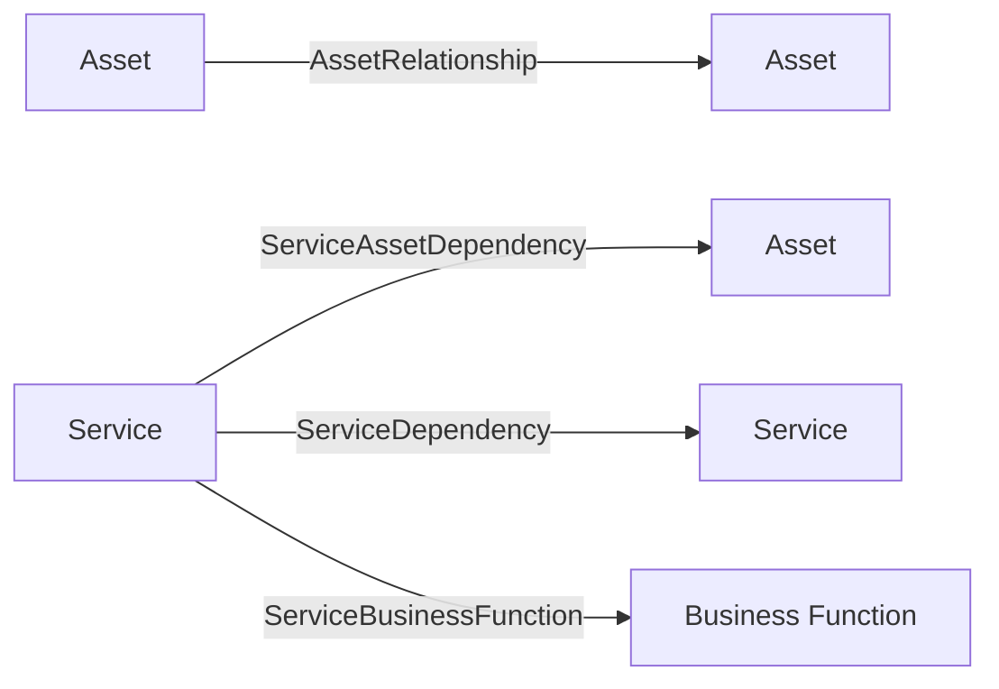
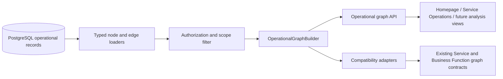

# Operational graph architecture

Status: C2.1 projection implemented; C2.2 lean dependency metadata implemented;
C2.3 analysis implemented with subsequent live LXC acceptance complete for its lean scope.
See the [C2.3 acceptance record](../testing/release-c2-explainable-dependency-analysis.md#subsequent-live-lxc-acceptance).

The [C2.4 operations experience](homelab-operations-experience.md) adds a batched
landscape read, opt-in Customer-scoped Site viewpoints, metadata and visual
Overview/Focus/Analysis while retaining default C2.1 API behavior.

This document describes the implemented C2.1 architecture and the approved
extension boundaries for later graph and analysis releases.

## Purpose

Atlas currently has several graph-shaped product surfaces:

- [Infrastructure Topology](infrastructure-topology.md) over Assets, recorded
  relationships and interface/Network membership;
- a focused Service graph;
- a focused Business Function graph; and
- summary and completeness views that depend on related operational records.

C2.3 dependency analysis and the next product surfaces — the C2.4 operational
homepage, visual Knowledge Graph, enhanced Service Operations, and later Change
Simulation — need consistent graph identity, direction, scope, metadata, and
traversal behavior.

Release C2.1 introduces a **shared operational graph projection** in the API. It
turns accepted relational records into a typed, bounded graph response without
creating a second source of truth.

## Implemented shape — 3 September 2026

The implementation follows the planned architecture in:

- `apps/api/app/services/operational_graph.py` for graph identity, source
  loading, authorization, traversal, metadata batching, and compatibility
  adaptation;
- `apps/api/app/routes/operational_graph.py` for the generic validated API;
- `apps/api/app/schemas.py` for typed graph contracts; and
- `apps/web/lib/operational-graph.mjs` plus
  `apps/web/components/operational-graph-view.js` for presentation-only
  normalization and rendering.

The builder accepts an authenticated `Principal`, validated `ActiveContext`,
and explicit projection request rather than a FastAPI `Request`. Compatibility
profiles constrain edge families by depth so the existing Service and Business
Function routes keep their C1 response shapes and expansion behavior while
sharing the C2.1 security and temporal rules.

Business Function completeness fields are `null`, not fabricated. Archived
Services and inactive Business Functions are excluded by the generic current
projection; the legacy focused routes allow only an inactive focus so existing
detail pages remain compatible.

## Architectural context

The completed foundation through C1 established these invariants:

- PostgreSQL is the durable system of record.
- The FastAPI API owns authentication, permissions, scope, validation, and
  persistence.
- Every interactive result is constrained by global/customer/site assignments.
- Evidence is not accepted operational knowledge.
- Assertions retain provenance and lifecycle independently from the operational
  record.
- Reconciliation is required before conflicting discovery changes accepted
  operational knowledge.
- Knowledge gaps describe missing or insufficient knowledge and are not
  reconciliation items.
- Services are separate from the Assets that implement them.
- Service dependency records are temporal and preserve source/target direction.
- Legitimate cycles between Services are allowed.
- Current focused graph routes intentionally avoid global recursive impact
  analysis.

C2.1 must build on these decisions rather than bypassing them.

It is intentionally valid to populate this graph entirely through current
manual UI/API workflows. Atlas is using manually entered and curated knowledge
for the immediate development period to validate the model before further heavy
investment in automatic discovery. Future plugin evidence must still pass
through the established observed-versus-accepted boundary.

## Decision summary

The governing decision is
[`../decisions/0001-shared-operational-graph.md`](../decisions/0001-shared-operational-graph.md).

In summary:

1. PostgreSQL operational records remain canonical.
2. The operational graph is derived at read time in the API.
3. Accepted current knowledge is the default graph input.
4. The graph exposes provenance and completeness qualifiers where available but
   does not invent a global confidence score in C2.1.
5. Existing focused graph endpoints remain compatible while their internal
   assembly is replaced.
6. No graph database, materialized graph store, scenario mutation, or impact
   propagation is introduced in C2.1.

## Terminology

### Accepted operational knowledge

The records Atlas currently uses to describe the working environment, including
Assets, Asset relationships, Services, Service dependencies, and Business
Functions after any required reconciliation.

A source-current assertion is not automatically accepted operational knowledge.

### Operational graph projection

A request-time typed representation of accepted operational records as nodes and
edges. It is a read model, not a persistence model.

### Focus

The authorized Asset, Service, or Business Function from which a bounded graph
projection begins.

### Structural traversal

Graph expansion used to collect connected nodes and edges. Structural traversal
does not itself decide failure propagation or business impact.

### Analysis traversal

The C2.3 operation applies lean dependency semantics and a hypothetical
unavailable input to structural graph paths, returning deterministic reason
codes, direct/downstream explanations, and unavailable/degraded/unknown results.

## Current source model



| Source record | Semantic role | Current temporal behavior |
| --- | --- | --- |
| `Asset` | Technical node | Current operational record |
| `AssetRelationship` | Asset-to-Asset structural or dependency edge | Current record; does not yet share the C1 temporal link contract |
| `Service` | Operational capability node | Current or archived record |
| `ServiceAssetDependency` | Service-to-Asset edge | `valid_from` and optional `valid_to` |
| `ServiceDependency` | Service-to-Service edge | `valid_from` and optional `valid_to`; non-self cycles allowed |
| `DependencyGroup` | Temporal `all`/`any`, required/optional, and failure-effect meaning for one Service need | Superseding versions preserve prior meaning |
| `DependencyGroupMembership` | Associates existing Service→Asset and Service→Service rows with a group | `valid_from` and optional `valid_to` |
| `BusinessFunction` | Lightweight business capability node | Current active/inactive record |
| `ServiceBusinessFunction` | Service-to-Business Function edge | `valid_from` and optional `valid_to` |
| `RelationshipType` | Stable key, labels, direction, endpoint applicability | Managed reference data |
| `KnowledgeCompletenessSummary` | Current completeness qualifier | One current summary per supported entity |
| `KnowledgeGap` | Missing, stale, or insufficient knowledge | Lifecycle-preserving active and historical gaps |
| `KnowledgeAssertion` | Provenance and claim history | Source-current and accepted states remain separate |

The graph builder reads the operational records. It may attach assertion,
source, completeness, or gap summaries, but it must not substitute an
unaccepted assertion for an operational node or edge.

## Logical architecture



The API remains the only authority for the graph result. The web application may
layout, filter, and present the response but may not infer inaccessible nodes,
relationship semantics, impact, confidence, or severity.

## Graph identity

Node identity must include the entity type because UUID uniqueness is guaranteed
within a table, not across all graph entity tables.

```text
asset:<uuid>
service:<uuid>
business_function:<uuid>
```

Edge identity must include the edge family:

```text
asset_relationship:<uuid>
service_asset:<uuid>
service_service:<uuid>
service_business_function:<uuid>
```

The response should retain the underlying UUID separately for route links and
API use. Web graph libraries should use the namespaced key. Display labels,
mutable names, frontend array positions, and traversal order are never identity.

## Node contract

A C2.1 node should contain enough information for consistent display and later
analysis qualification without becoming an unbounded entity serializer.

Recommended fields:

- `key`;
- `entity_type`;
- `entity_id`;
- `customer_id`;
- `site_id`;
- `name`;
- `subtitle` or type label;
- `href`;
- lifecycle state where applicable;
- operational state where applicable;
- criticality key/name where applicable;
- completeness status;
- open knowledge-gap count;
- source where available; and
- updated time where available.

The graph response should not copy every custom field, note, assertion, or raw
evidence item. Detail routes remain the place for full records.

## Edge contract

A C2.1 edge should preserve semantic direction and its source record family.

Recommended fields:

- `key`;
- `edge_family`;
- `edge_id`;
- `source_key`;
- `target_key`;
- managed relationship type key and name;
- source-side display label;
- `required_for_operation` where the source model supports it;
- dependency group ID/name, `all`/`any` strategy, required/optional meaning,
  and unavailable/degraded/unknown effect for Service dependency edges;
- `valid_from` and `valid_to` where supported;
- source where available; and
- `knowledge_state`, initially `accepted` for the operational projection.

The graph may be visually laid out left-to-right, top-to-bottom, or around a
focus node, but the stored `source_key` and `target_key` must never be reversed
only to suit presentation.

## Relationship semantics

C2.1 carries current relationship metadata; it does not yet decide how a failure
propagates.

For example:

- `runs_on` may indicate a hosting relationship;
- `depends_on` may indicate an operational dependency;
- `uses_storage` may indicate a storage path;
- `supports` may connect a Service to a Business Function; and
- `connects_to` may be structural rather than a sufficient outage rule.

The web must render API-provided labels rather than maintain hard-coded semantic
key lists for operational conclusions.

There are four distinct direction concepts:

- **stored direction** is the source and target persisted by the authoritative
  relationship row;
- **canonical semantic direction** is that source-to-target meaning together
  with its managed Relationship Type metadata;
- **traversal direction** selects incoming, outgoing, or both edges relative to
  a focus/frontier node; and
- **presentation direction** controls visual layout or optional inverse wording.

Reverse traversal never swaps the canonical source and target, changes the
Relationship Type, or turns an inverse display label into a different edge.
This prevents later impact analysis from reinterpreting presentation choices as
operational meaning.

Release C2.2 additively exposes required/optional meaning, `all`/`any`
redundancy, and explicit unavailable/degraded/unknown failure effects on
`service_asset` and `service_service` edges. Ungrouped edges retain
`required_for_operation`, derive the equivalent requirement, and return
`failure_effect=unknown`; no unavailable result is inferred. These fields
describe accepted semantics only. The graph still does not calculate failure
consequences.

## Authorization and non-disclosure

### Focus authorization

The API resolves the focus record and applies the corresponding permission and
scope check. An unauthorized focus should return the established non-disclosing
response behavior.

### Expansion authorization

Every edge expansion resolves both endpoints. The complete edge is omitted when
either endpoint cannot be viewed. The API must not return:

- a dangling edge;
- an inaccessible endpoint ID or label;
- a hidden-node count;
- a warning that reveals an inaccessible entity;
- a truncation count that includes inaccessible entities; or
- an error message that distinguishes an inaccessible endpoint from a missing
  endpoint where current policy hides existence.

### Mixed permissions

A principal may be allowed to view an Asset but not Services, or a Business
Function but not an adjacent Asset. The graph result includes only the subgraph
permitted by the caller's explicit permissions and assignments.

The active workspace context narrows the request but does not replace object
scope checks.

## Accepted knowledge and provenance

The default operational graph includes:

- accepted `Asset` and `Service` fields;
- current accepted Asset relationships;
- active temporal Service links at the captured request time; and
- active Business Functions.

It excludes unaccepted source observations as operational edges.

Where bounded and useful, the graph can expose qualifiers such as:

- source (`manual`, discovered/accepted, or another current source label);
- completeness status;
- open gap count;
- last updated time;
- assertion or evidence summary references; and
- a warning that an entity has unresolved knowledge.

C2.1 does not calculate a universal numeric confidence score. C2.3 also avoids
an elaborate confidence engine: unknown knowledge produces `unknown`. Any later
numeric confidence concept would require a separate documented evidence model
and formula.

## Temporal behavior

C2.1 is a current operational projection. The builder captures one request time
and uses it consistently for the whole response. For temporal Service links, an
edge is active when:

```text
valid_from <= request_time
and (valid_to is null or valid_to > request_time)
```

The exact inclusive/exclusive boundary should be implemented consistently with
existing repository conventions and covered by tests.

For source models without temporal history, such as `AssetRelationship`, C2.1
returns the current accepted record. Caller-selected historical projection is a
later feature and must not be exposed in C2.1. The response includes the
captured generation/request time; it does not imply historical reconstruction.

## Projection boundaries

C2.1 supports a focused bounded projection:

- focus entity required;
- structural depth `0..3`;
- incoming, outgoing, or both directions;
- optional edge-family filter;
- deterministic node limit; and
- explicit truncation.

Depth is measured by graph edges from the focus. It is a display/projection
boundary, not a failure-propagation boundary.

## Builder behavior

The builder should:

1. resolve and authorize the focus;
2. create its namespaced node;
3. load eligible edges for the current frontier in deterministic batches;
4. resolve and authorize endpoints;
5. apply current-valid rules at the captured request time;
6. add each authorized edge once;
7. add newly discovered nodes once;
8. queue unvisited nodes until the requested structural depth;
9. stop deterministically at the node limit;
10. attach bounded node and dependency-group metadata in batches;
11. sort the final nodes and edges by stable keys; and
12. return warnings and truncation state.

A visited-node set prevents infinite expansion through cycles. It must not remove
an edge between nodes already present.

## Determinism

The same principal, database state, query, and captured request time should
produce the same ordered response.

Determinism requires:

- stable namespaced keys;
- explicit database ordering or in-memory stable sorting;
- deterministic frontier processing;
- deterministic truncation; and
- no dependence on unordered set or relationship iteration in the serialized
  result.

This supports reliable tests, caching decisions, exports, and future analysis
fingerprints.

## API shape

The implemented generic route is:

```text
GET /api/operational-graph
```

See [`../product/release-c2-plan.md`](../product/release-c2-plan.md) for proposed
parameters and response fields.

The endpoint should use existing API conventions:

- Pydantic response models;
- explicit permission dependencies;
- central scope helpers;
- bounded query parameters;
- safe `404`/`403` behavior;
- no browser-only trust; and
- no commits or persistence for a read projection.

## Compatibility adapters

C2.1 should preserve:

```text
GET /api/services/{service_id}/graph
GET /api/business-functions/{function_id}/graph
```

These routes should call the shared builder and adapt its result to the current
`ServiceGraphResponse`. This proves shared semantics while avoiding an immediate
breaking change.

The current route-specific graph code should be removed only after the adapters
cover current behavior and regression tests pass.

At the audited pre-C2.1 baseline, the focused routes differed in adjacent-node
permission checks. The delivered shared builder now makes focus and every
expansion endpoint authoritative while the adapters preserve response shape.
The earlier mixed-permission gap was not retained as compatibility behavior.

## Query efficiency

The builder should avoid a database query per node or edge.

Preferred techniques:

- batch-load frontier edges;
- batch-load endpoint records by entity type;
- load Relationship Types into a keyed map;
- load completeness summaries and gap counts for all result nodes in bounded
  queries;
- use existing primary-key and active-edge indexes; and
- stop expansion before loading unnecessary deeper frontiers.

Correctness and authorization take precedence over caching. C2.1 should not use
Redis as a graph cache.

## Error and warning behavior

Safe warnings may include:

- node limit reached;
- requested edge family not supported for the focus type;
- a viewable entity has incomplete knowledge.

Warnings must not name or count inaccessible entities.

Missing managed Relationship Type metadata should use a safe fallback label and
may emit a non-sensitive warning. The underlying operational edge should not be
silently reinterpreted.

## Extension to C2.2

Release C2.2 may add:

- dependency group IDs;
- required/optional semantics compatible with `required_for_operation`;
- group strategy (`all` or `any`);
- failure effect (`unavailable`, `degraded`, or `unknown`); and
- completeness gaps for unclassified critical dependencies.

The C2.1 edge contract should be additive-friendly. Optional fields can be added
without changing node identity or current edge family keys.

`minimum`, quorum, `minimum_available`, weighted rules, conditional rules, and
richer dependency-group or recovery-preference semantics remain valid additive
enterprise extensions, but they are not C2.2 or Homelab Ready requirements.

## Extension to C2.3 and Release E

Release C2.3 consumes the shared builder through an internal analysis profile.
It follows incoming Service dependencies, probes the bounded frontier, then
completes outgoing dependency sets for reached Services. Endpoint authorization,
current-valid filtering, group metadata and identity use the existing builder.
The generic structural route now accepts depth `0..3` for expanded Knowledge Graph exploration; the analysis profile and its independent bounds are unchanged. See
[dependency analysis](dependency-analysis.md) for the implemented contract,
scenario assumptions, fixed-point evaluation and safety limits.

It adds:

- recursive analysis traversal;
- `all`/`any` dependency evaluation;
- unavailable/degraded/unknown consequence evaluation;
- explanation paths;
- reason codes;
- direct/downstream classification;
- `unaffected` only where defensible; and
- analysis engine/schema versioning.

C2.3 provides a contained explainable homelab analysis outcome; it is not live
outage monitoring or full enterprise Impact Analysis. Release E later adds
richer failure, recovery, business-impact, and scenario workflows. The
operational graph remains the structural input; the analysis result is a
separate output.

## Consumption by C2.4

C2.4's visual Knowledge Graph, homepage, and Service Operations experience
should consume the stable API-owned graph and analysis contracts. The web layer
may choose layout, focus, presentation filters, responsive behavior, and
accessible fallbacks. It must not reconstruct authoritative graph membership,
dependency effects, or authorization from raw database-shaped data. Later
C3/C4/D/E/F metadata should enrich these contracts additively rather than force
a replacement frontend architecture.

## Extension to Release F

Planned-change simulation must use a scenario overlay rather than updating
accepted operational records.

A later scenario layer may:

1. load an accepted operational graph;
2. apply in-memory or persisted proposed mutations;
3. run the same analysis engine against the overlaid graph; and
4. preserve the scenario and immutable result separately.

C2.1 must not add scenario flags to current Assets or relationships as a shortcut.

## Relationship to B2 live discovery

C2.1 projects accepted operational records regardless of whether they were
created manually, through simulation and reconciliation, or through a future
live Integration run. It does not depend on completing B2 first.

However, C2.1 must not convert structural graph metadata into claims that an
Asset is currently responding, a source is fresh, a Service is healthy, or a
recovery path is available. Those conclusions require B2 freshness/telemetry and
later recovery and analysis semantics.

Integration CRUD, secret resolution, worker dispatch, scheduling, retries, and
live Proxmox execution remain outside the operational graph release.

## Data migration

C2.1 required no graph persistence migration and reused the existing permissions
and operational tables.

C2.2 will likely need an additive migration for dependency semantics. That design
requires its own review and may require a new ADR if it changes operational
meaning or temporal behavior.

## Testing obligations

The release test plan is
[`../testing/release-c2-operational-graph.md`](../testing/release-c2-operational-graph.md).

At minimum, tests must cover:

- all node and edge families;
- semantic direction;
- namespaced identity;
- authorized and unauthorized focus;
- hidden endpoint non-disclosure;
- cross-customer/site substitution;
- current-valid temporal boundaries and absence of a C2.1 historical query;
- cycles;
- deterministic ordering;
- node-limit truncation;
- compatibility of existing focused routes; and
- representative query performance.

## Operational non-goals

C2.1 does not prove:

- that an Asset is currently responding;
- that a Service is healthy;
- that a backup succeeded;
- that a recovery target is available;
- that an outage would propagate through a particular path;
- that a recovery will complete within RTO; or
- that a proposed change is safe.

Those claims require later operational evidence and analysis semantics.

## Dependency impact presentation

Dependency Groups remain explicit, temporal domain objects; the browser does
not change graph identity, persistence, authorization, traversal or analysis.
In the normal Knowledge Graph, a group with one distinct relationship in the
acquired authorized projection renders as its original direct relationship.
Two or more relationships retain an intermediate group with the recorded ALL or
ANY strategy. Ungrouped Unknown relationships also remain direct.

The presentation counts members before client filters and lane disclosure, and
retains that count through normalization. Filtering a known two-member group
down to one visible relationship therefore does not flatten it. Counts describe
the acquired authorized projection, not a claim about undisclosed or unacquired
members. The existing API does not expose global group cardinality; a bounded
projection containing only one member can consequently appear direct. No hidden
member count is requested or disclosed to resolve this limitation.

Direct edges retain group ID/name, strategy, requirement, failure effect,
relationship label, endpoints and stable identity. Select an entity for its
relationship details, or open **Recorded relationships in this view**, then
**Dependency impact details**, with mouse, keyboard or touch. That disclosure
links to the source Service for classification. The canvas prioritizes topology
without permanently stacking semantic chips on each edge. The compact dashboard
landscape retains its existing entity-only presentation.


### Layout and display names

The three lanes retain their domain meaning. The presentation layout places
Assets beside their connected Services, keeps members of a requirement together,
aligns Business Functions with their supporting Services, and packs Services
without Asset providers into available vertical space. Shared Assets appear once
with all relationships retained. Ordering and routing are deterministic and do
not alter semantic direction, edge identity or traversal. Entity cards are
visually stronger than the smaller dependency-group markers; orthogonal routing
uses separate space for same-lane Service dependencies. Narrow viewports retain
native scrolling instead of shrinking text.

Generated group names now use domain names (for example `DNS Providers` or
`DNS — AdGuard Home`) with numeric collision suffixes. Historical UUID-style
names get a friendly display-only fallback derived from the source Service.
Readable authored names are retained. Persisted names and group history are not
rewritten merely by viewing them; original names remain available in explicit
advanced/technical editing and analysis details.

### Dashboard normalization boundary

The graph API supplies `source_key` and `target_key`; its optional `source` field
is provenance text, not a node. Dashboard data ingestion normalizes the graph
once before distributing it to widgets. All rendered relationship endpoints
must resolve to nodes in that authorized response. Null/malformed records and
dangling endpoints are excluded, never reconstructed from inaccessible data.
Knowledge Attention counts and links use that same normalized set and consider
only Service→Asset and Service→Service dependencies. A legacy dependency without
an explicit failure effect remains Unknown. No backend schema change is involved.
