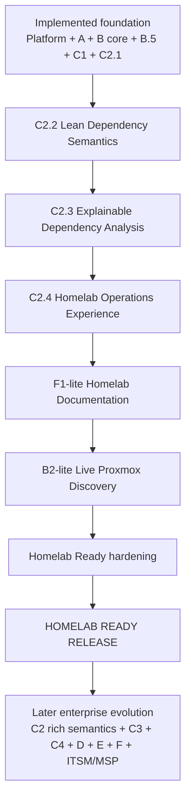
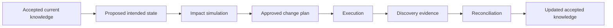

# Atlas development roadmap

Planning baseline: 3 September 2026

## Purpose

This document is the canonical forward-looking roadmap for Atlas. It enhances,
rather than replaces, the release structure already established in the
repository.

The roadmap and the implementation ledger serve different purposes:

- [`feature-ledger.md`](feature-ledger.md) records what is implemented at the
  audited commit named in that document.
- This roadmap records what should be delivered next, the dependencies between
  releases, and the product outcomes each release enables.
- [`mvp-brief.md`](mvp-brief.md) remains the historical brief for the completed
  foundation through Release C1.

A roadmap status must not be treated as implementation evidence. When a release
is delivered, the feature ledger should be re-audited against a named commit.

## Product direction

Atlas should evolve from a secure infrastructure and Service knowledge platform
into an explainable operations platform that can answer four increasingly
valuable questions:

1. **What exists, and what does Atlas know about it?**
2. **What provides each Service and Business Function?**
3. **What would be affected if an Asset, Service, or dependency failed?**
4. **What would change if a proposed future state were implemented?**

The next releases should not create separate graph logic for the homepage,
Service Operations, dependency analysis, and later Change Simulation. They
should build on the shared, API-owned operational graph and analysis foundation
that each product view consumes.

For the immediate development period, Atlas will deliberately rely on manually
entered and curated accepted knowledge. This is a product-validation strategy:
prove and refine the knowledge, Service, relationship, and graph models before
investing heavily in additional discovery plugins and worker orchestration.
Automatic discovery remains an important later capability, and observed
evidence remains distinct from accepted operational knowledge.

## Near-term product target: Homelab Ready

Atlas's near-term target is a genuinely useful, attractive, publicly usable
**Homelab Ready Release**. A homelab operator should be able to install Atlas,
manually curate or discover enough knowledge, understand the environment
visually, explore Services and dependencies, identify basic dependency
consequences, see knowledge gaps, and use Atlas as a polished day-to-day
operations knowledge product.

Homelab Ready requires the smallest correct extensible foundation and a strong
product experience. It does **not** require People/Teams, enterprise ownership
hierarchies, formal Knowledge Objects everywhere, advanced recovery evidence,
quorum or arbitrary minimum-count rules, weighted dependencies, sophisticated
confidence scoring, intended-state simulation, change approval, full ITSM,
production-scale orchestration, multiple discovery plugins, or complete
enterprise Impact Analysis.

## Roadmap principles

1. **Preserve the current system of record.** PostgreSQL operational records
   remain canonical. Evidence, assertions, reconciliation, and knowledge gaps
   retain their current meanings.
2. **Derive graphs; do not create a second truth store.** The operational graph
   is a scoped projection of accepted records unless a later ADR explicitly
   changes that decision.
3. **Keep authorization server-side.** Every graph, count, path, summary, and
   export must apply the existing global/customer/site permission model.
4. **Make uncertainty visible.** Atlas must distinguish accepted, asserted,
   inferred, stale, incomplete, and unknown knowledge. It must not present an
   objective, note, or inferred relationship as live proof.
5. **Build one analysis engine.** Failure impact and planned-change impact should
   use the same graph and analysis primitives with different scenario inputs.
6. **Deliver progressively.** Early releases may show structural context and
   knowledge readiness before Atlas can prove live availability or recovery.
7. **Preserve compatibility.** Existing routes and UI journeys should remain
   usable while shared services replace duplicated implementation internally.
8. **Use additive migrations.** Existing Assets, Services, relationships,
   assertions, changes, gaps, and generated documents must survive upgrades.
9. **Homelab simplicity must not prevent future enterprise richness.** A small
   truthful model should be able to gain richer enterprise semantics through
   additive schema and API changes; future complexity is not required merely to
   prove that extension is possible.

## Repository-grounded current position

| Release area | Status | Roadmap interpretation |
| --- | --- | --- |
| Platform and inventory foundation | Implemented | Retain and harden; do not reopen the tenancy or authorization model for C2 |
| Release A — Knowledge Foundation | Implemented | Reuse evidence, assertions, accepted knowledge, and meaningful changes |
| Release B — Discovery and Reconciliation | Core simulation and reconciliation implemented; live operation partial | Complete B2-lite for Homelab Ready, then add scheduling, broad retries and richer orchestration later |
| Release B.5 — Knowledge Completeness | Implemented for Assets and Services | Extend later to Business Functions, ownership, recovery, documentation, and intended-state objects |
| Release C1 — Homelab Service MVP | Implemented | Preserve first-class Services, Business Functions, temporal dependencies, recovery fields, provenance, completeness, and focused graphs |
| Release C2 — shared graph and explainable dependency foundation | C2.1 complete; C2.2 complete; C2.3 complete; C2.4 next/planned | Build on live-accepted lean consequences to deliver the polished visual operations experience |
| F1-lite — Homelab Documentation | Planned; renderer and persistence exist | Expose existing generated Markdown through usable Documents API and UI without waiting for C4 |
| B2-lite — Live Proxmox Discovery | Partially implemented foundation | Complete a secure configure, test, Run Now, result, and reconciliation journey for Proxmox |
| Homelab Ready Release | Planned | Harden and package the combined product as a high-quality self-hosted homelab release |
| Release C3 — People, Teams and structured ownership | Planned after Homelab Ready | Deliver structured accountability without discarding C1 text labels |
| Release C4 — formal Knowledge Objects | Planned after Homelab Ready | Create the reusable content model for runbooks, recovery procedures, change plans, validation, and intended state |
| Release D — Backup and Recovery | Planned | Split knowledge readiness from evidence-backed recoverability |
| Release E — full Impact Analysis | Planned; structural prerequisites exist | Deliver failure analysis, then recovery-aware analysis, then planned-change impact |
| Release F — Documentation and intended state | Partial foundation | Expose documents, model intended state, and reconcile actual state after change |
| Later enterprise/community packaging | Not established | Build beyond the contained Homelab Ready quality bar only when later deployment needs justify it |

## Sequencing decision

**C2.1 — Shared Operational Graph**, **C2.2 — Lean Dependency Semantics**, and
**C2.3 — Explainable Dependency Analysis** are complete, including live LXC
acceptance for their respective scopes. **C2.4 — Homelab Operations Experience**
is next/planned, followed by F1-lite, B2-lite, and Homelab Ready hardening.

F1-lite and B2-lite may proceed in parallel where dependencies permit, but they
must not broaden into C4 or a production-scale worker control plane. Atlas must
not make live availability, freshness, or recovery claims until relevant live
evidence exists.

## Dependency view

This is the product-priority path, not a prohibition on contained parallel
work. C3, C4, D, full E, and later F remain important, but they are not Homelab
Ready prerequisites.

# Release C2 — graph, dependency analysis, and operations experience

Release C2 builds on the reusable C2.1 graph foundation with lean semantics,
explainable dependency analysis, and a polished homelab experience. It does not
deliver every enterprise Impact Analysis or Change Simulation workflow.

## C2.1 — Shared Operational Graph

**Status:** implemented and merged to `dev` in `1842d16`

**Outcome:** Atlas has one server-side graph projection service that represents
accepted Assets, Asset relationships, Services, Service dependencies, and
Business Functions within the caller's authorized scope.

C2.1 delivers:

- stable typed and namespaced node and edge contracts;
- graph data derived from existing relational operational records;
- Asset relationships, Service→Asset, Service→Service, and
  Service→Business Function edges;
- preserved semantic edge direction and managed relationship labels;
- incoming, outgoing, and both-direction traversal;
- edge-family filtering;
- only links valid at request time, using each temporal source's
  `valid_from`/`valid_to` contract;
- useful operational metadata such as lifecycle, operational state,
  criticality, completeness status, source, and timestamps where available;
- deterministic ordering, deduplication, cycle-safe projection, bounded
  depth, and explicit truncation warnings;
- server-side authorization and non-disclosure for focus entities,
  endpoints, counts, paths, warnings, and summaries;
- a generic focused graph API;
- existing Service and Business Function graph routes using the
  shared builder while preserving their response contracts initially; and
- reusable web graph normalization and presentation components.

C2.1 must not:

- introduce a graph database;
- write a second copy of accepted operational knowledge;
- calculate outage propagation, recovery estimates, or business impact;
- assign a synthetic global confidence percentage;
- treat raw source-current assertions as accepted operational state; or
- implement hypothetical scenario mutations.

Historical point-in-time graph projection is a later feature. C2.1 may use a
single internally captured request time for deterministic membership, but it
does not expose a caller-selected historical `as_of` query.

Detailed scope is in [`release-c2-plan.md`](release-c2-plan.md), architecture is
in [`../architecture/operational-graph.md`](../architecture/operational-graph.md),
and the governing decision is
[`../decisions/0001-shared-operational-graph.md`](../decisions/0001-shared-operational-graph.md).

## C2.2 — Lean Dependency Semantics

**Status:** implemented on the C2.2 feature branch; live LXC acceptance complete

**Outcome:** Atlas can represent the dependency meaning required for truthful,
useful homelab consequence analysis while preserving the current
`required_for_operation` contract and an additive path to richer semantics.

Homelab scope:

- required and optional dependencies;
- redundancy strategy `all` or `any`;
- operational failure effect `unavailable`, `degraded`, or `unknown`;
- explicit unknown semantics where a structural relationship has not been
  classified; and
- safe additive migration and history preservation for current C1 dependency
  rows and `required_for_operation` behavior.

C2.2 does not require `minimum`, quorum, `minimum_available`, weighted or
conditional rules, recovery preference ordering, or a rich dependency-group
language. The schema and API should permit those concepts to be added later
without breaking current identities, history, or consumers.

Implementation uses temporal dependency groups and memberships over the
existing authoritative Service→Asset and Service→Service rows. Existing
ungrouped data remains valid, `required_for_operation` remains available, and
unknown effects remain explicit. The API, Operational Graph contract, and
normal Service workflow expose the new meaning without performing consequence
analysis.

## C2.3 — Explainable Dependency Analysis

**Status:** implemented on the C2.3 working tree; subsequent live LXC acceptance
complete for its lean scope.
See [implementation and acceptance evidence](../testing/release-c2-explainable-dependency-analysis.md).

**Outcome:** A user can ask what known Services may be affected if an Asset or
Service becomes unavailable and receive a bounded, deterministic explanation.

C2.3 answers:

- which known Services may be affected by an unavailable Asset;
- which dependent Services may be affected by an unavailable Service;
- whether each result is direct or downstream;
- why Atlas reached each conclusion, using the actual dependency path and known
  semantics; and
- when Atlas cannot determine a result because dependency semantics are unknown.

Homelab result states are deliberately small: `unavailable`, `degraded`,
`unknown`, and `unaffected` where the known model makes that defensible. Missing
knowledge yields `unknown`, not an invented probability or elaborate confidence
score.

The implementation may use bounded recursive analysis, but it must remain
deterministic, cycle-safe, authorization-safe, explicit about truncation, and
understandable. C2.3 is not a general enterprise reasoning framework or proof
of live outage state.

## C2.4 — Homelab Operations Experience

**Outcome:** Atlas turns its technical foundations into a polished, highly
visual product that is compelling to use and demonstrate. This is a major
product release, not cosmetic cleanup.

### Operational homepage

Use real Atlas data to answer: What is my environment? What matters? What does
Atlas know? What should I look at? Useful content may include Assets, Services,
Business Functions, completeness, Knowledge Gaps, recent meaningful changes,
critical Services, and dependency warnings or unknowns. Avoid dashboard clutter
and do not imply live health without live evidence.

### Visual Knowledge Graph

Build a polished interactive graph over the existing C2.1 API with clear Asset,
Service, and Business Function distinction; readable labels and semantic
direction; entity focus and navigation; useful bounded-depth and edge-family
controls; responsive and accessible behavior; and clear empty, large-result,
and truncated states. The API remains authoritative for graph membership and
semantics; impact logic does not move into the browser.

### Enhanced Service Operations and exploration

Service pages should show what provides a Service, what it depends on, what
depends on it, which Business Functions it supports, criticality, completeness,
dependency warnings or unknowns, and available C2.3 consequence information.
Users should move naturally from Asset to Service to Business Function and
related infrastructure without understanding the database model.

### Product polish

Apply deliberate visual hierarchy, spacing, responsive layouts, graph
interactions, loading and empty states, consistent terminology, theme
compatibility, accessibility, and Atlas Impact branding. The result should feel
like a finished product surface rather than developer scaffolding.

# Release C3 — People, Teams and structured ownership

**Outcome:** Atlas records accountable people and teams as structured entities
while retaining C1 text labels for compatibility and migration evidence.

**Sequencing:** C3 is a later internal-IT/MSP/enterprise capability, not a
Homelab Ready prerequisite. Current free-text owner, technical-contact, and
support-group fields remain acceptable for the homelab release.

Initial scope should include:

- Person and Team records;
- Team membership;
- role-based ownership assignments such as business owner, Service owner,
  technical owner, support team, recovery owner, change owner, and escalation
  contact;
- customer/site scope and authorization;
- active/inactive lifecycle;
- migration or deliberate association from existing `owner_name`,
  `technical_contact`, `support_group`, and Business Function owner labels;
- completeness rules for required ownership; and
- ownership display in Service Operations, recommendations, impact reports, and
  change plans.

C3 should not silently delete or reinterpret existing labels. They remain useful
for installations that do not need a formal people directory.

# Release C4 — formal Knowledge Objects

**Outcome:** Atlas has a reusable, versioned content model rather than creating
separate document mechanisms for Services, recovery, changes, and intended
state.

**Sequencing:** C4 is later enterprise evolution, not a Homelab Ready
prerequisite. Atlas may expose its existing generated documentation through
F1-lite first, provided generated content is not presented as reviewed human
knowledge.

Candidate Knowledge Object types include:

- Service description;
- architecture document;
- operational runbook;
- backup policy;
- recovery procedure;
- validation procedure;
- change plan;
- rollback plan;
- intended-state definition;
- decision record;
- evidence record;
- known issue; and
- support procedure.

Knowledge Objects should support:

- customer/site ownership;
- type, title, status, version, and lifecycle;
- structured or Markdown content;
- links to Assets, Services, Business Functions, People, Teams, scenarios, and
  evidence;
- owner and approver assignments when C3 exists;
- source and provenance;
- last verified time;
- completeness requirements; and
- non-destructive supersession and history.

The existing generated `Document` rows should be integrated deliberately. C4
must not discard generated Markdown or misrepresent it as a reviewed runbook.

# Release D — Backup and Recovery

Release D should be split so Atlas can deliver honest early value without
claiming unproven recoverability.

## D1 — Recovery Knowledge Readiness

**Outcome:** Atlas can determine whether sufficient recovery knowledge exists.

A Service assessment may consider:

- RTO and RPO present;
- backup policy or notes present;
- recovery procedure present;
- recovery target identified;
- required dependencies modelled;
- accountable recovery owner assigned;
- validation instructions present;
- knowledge is sufficiently current; and
- no unresolved critical recovery knowledge gaps exist.

The user-facing term should be **Recovery knowledge readiness** or similarly
qualified. It must not be labelled proof that a restore will succeed.

## D2 — Validated Recovery Evidence

**Outcome:** Atlas can distinguish documented, observed, validated, and tested
recovery paths.

Capabilities may include:

- protection policies;
- backup execution evidence;
- backup success and failure history;
- recovery targets and eligibility;
- recovery procedures and steps;
- recovery test records;
- last successful restore;
- observed or tested recovery duration;
- evidence freshness; and
- path selection with an explanation.

Exact restoration estimates and claims such as “within RTO” require evidence.
An RTO is an objective, not an estimated duration.

D2 depends on the live Release B stream for trustworthy operational evidence.

# Release E — Impact Analysis

## E1 — Explainable Failure Impact

**Outcome:** Atlas extends C2.3's lean Service consequence analysis into a
dedicated enterprise Impact Analysis workflow spanning richer scenarios,
Business Functions, evidence qualification, prioritisation, and persisted
results where justified.

The workflow should:

1. resolve the selected entity inside the caller's scope;
2. load the accepted graph at an analysis time;
3. apply a temporary failure state without mutating operational data;
4. evaluate dependency semantics;
5. identify directly and indirectly affected Assets, Services, and Business
   Functions;
6. classify results as unavailable, degraded, potentially affected, unknown, or
   unaffected;
7. show each reasoning path, evidence basis, and knowledge limitation; and
8. optionally persist an immutable analysis result.

E1 delivers the dedicated full Impact Analysis screen but does not require
validated recovery evidence. C2.3 remains the smaller Homelab Ready analysis
surface and must not be relabelled as complete enterprise Impact Analysis.

## E2 — Recovery-aware Impact Analysis

**Outcome:** Impact results include qualified recovery options.

Once D2 exists, the result may show:

- recovery objective;
- documented and validated procedures;
- eligible recovery targets;
- evidence freshness;
- observed or estimated duration basis;
- recovery gaps; and
- a recommended path with explicit decision reasons.

Atlas must show `unknown` when evidence does not support a conclusion.

## E3 — Planned Change Impact

E3 is delivered jointly with F2 because planned-change analysis requires an
intended-state overlay.

Initial scenario types may include:

- replace an Asset;
- move a workload;
- remove or disable a relationship;
- add an alternate dependency;
- change a storage or network path; and
- take an Asset or Service offline for maintenance.

Failure Impact and Change Impact should use the same analysis engine. The
scenario mutation is different; the graph and reasoning rules are shared.

# F1-lite — Homelab Documentation

**Outcome:** Existing deterministic Asset Markdown and persisted `Document`
records become a useful homelab product surface without waiting for C4.

Minimum scope:

- a Documents API;
- Documents list and detail pages;
- readable, safe Markdown rendering;
- links from relevant Assets;
- download/export when straightforward; and
- a clear distinction between generated documentation and reviewed,
  human-authored knowledge.

F1-lite should preserve an additive path toward later C4/F1 convergence. It
must not label generated Markdown as an approved runbook or require the full
Knowledge Object model.

# Release F — Documentation and intended state

## F1 — Mature Documentation Experience

**Outcome:** Users can browse, create, link, version, and verify Knowledge
Objects through Atlas.

F1 extends the contained F1-lite surface into the mature versioned Knowledge
Object experience after C4. It does not invalidate or discard generated
Markdown exposed for Homelab Ready.

The product should expose generated documents without confusing generated facts
with approved human knowledge. Service, Asset, Business Function, recovery, and
change views should link to the same object model.

## F2 — Intended State and Change Simulation

**Outcome:** Atlas represents a proposed future state separately from accepted
current knowledge and uses it as an overlay for E3 analysis.

The change lifecycle should include:

- draft scenario;
- proposed graph mutations;
- before-and-after comparison;
- impact analysis;
- assumptions and unknowns;
- implementation steps;
- validation checks;
- rollback steps;
- owner and target window;
- approval state; and
- immutable analysis run metadata.

A draft or simulated scenario must never update operational Assets,
relationships, Services, or accepted assertions.

## F3 — Post-change Discovery and Reconciliation

**Outcome:** Atlas closes the loop between intended and observed state.

After execution, Atlas should compare new discovery evidence with the intended
state, create reconciliation items for differences, and preserve the original
plan and analysis for audit and learning.

# B2-lite — Live Proxmox Discovery

**Outcome:** A homelab user can configure Proxmox, test the connection, and
deliberately run discovery from Atlas.

Minimum Homelab Ready scope:

- real Integration CRUD and replacement of the mock Integrations page;
- safe secret-reference handling;
- Test Connection;
- Run Now;
- actual Proxmox plugin invocation;
- Discovery Run status, results, and clear failure reporting; and
- evidence and reconciliation through existing Atlas capabilities.

Use the smallest secure execution boundary. Do not compromise secrets,
authorization, tenant ownership, or request-lifecycle safety merely to avoid a
worker boundary. A minimal queue is appropriate only if correctness requires
it. Scheduling, broad retry/cancellation policy, distributed worker control,
multiple plugins, and production-scale orchestration are later B2 evolution;
scheduling should follow a reliable Run Now journey.

# Homelab Ready hardening

This is a contained quality bar for a high-quality self-hosted release, not
enterprise production certification:

- complete the Interface-first IP experience by using primary Interface and
  Network records consistently in Asset create, edit, list, filtering, and
  sorting journeys; retain `Asset.ip_address` only for migration and read
  compatibility until a deliberate deprecation decision is made;
- installation and upgrade testing;
- backup and restore guidance;
- security review;
- operator documentation and first-run/onboarding improvement;
- browser, mobile, theme, and accessibility validation;
- Docker deployment validation;
- repeatable release artefacts;
- replace the mock Integrations page through B2-lite rather than treating the
  current scaffolding as a complete product journey;
- expose the existing generated Asset Markdown through F1-lite; and
- preserve legacy Service-type Assets without automatic conversion until a
  deliberate association or migration workflow is designed.

# Product views are cross-release surfaces

The concept screens are not four replacement releases. They are product views
that become richer as roadmap capabilities arrive.

| Product view | Initial foundation | Later enrichment |
| --- | --- | --- |
| Homepage | A, B, B.5, C1 for inventory, changes, reconciliation, Service counts, and knowledge gaps | C2.4 visual environment experience; later C3 ownership, C4 documentation, D recovery readiness, E risk recommendations, and F planned changes |
| Service Operations | C1 Service model and focused graph | C2.2 semantics, C2.3 consequences, and C2.4 visual experience; later C3/C4/D/E/F enrichment |
| Dependency Analysis | C2.1 graph plus C2.2 semantics | C2.3 explainable homelab consequences; later E enterprise impact and D2 recovery evidence |
| Change Impact | C2 graph; E analysis engine | C3 owner; C4 change/validation objects; F2 intended-state overlay; F3 post-change reconciliation |

## Homepage metric rules

Every homepage metric should have:

- a documented formula;
- a visible denominator;
- a calculation time;
- a drill-down to source entities;
- explicit handling of unknown and stale data; and
- terminology that matches the evidence actually held.

Examples:

- Do not say an Asset is “responding” unless a monitoring or discovery source
  has supplied an appropriate current signal.
- Do not say a Service is recoverable merely because RTO/RPO and notes exist.
- Do not derive an estimated restoration duration from the RTO.
- Keep accepted knowledge changes, reconciliation review, and planned changes as
  separate activities.

# Recommended delivery sequence

1. Preserve the completed **C2.1 — Shared Operational Graph** and
   **C2.2 — Lean Dependency Semantics**.
2. Preserve the completed, live-accepted **C2.3 — Explainable Dependency Analysis**.
3. Next, deliver **C2.4 — Homelab Operations Experience**: dashboard, visual
   Knowledge Graph, enhanced Service Operations, and product polish.
4. Deliver **F1-lite — Homelab Documentation**.
5. Deliver **B2-lite — Live Proxmox Discovery**: configure, test, Run Now,
   inspect results, and reconcile. Contained B2-lite/F1-lite work may proceed in
   parallel where dependencies permit.
6. Complete **Homelab Ready hardening** and ship the **HOMELAB READY RELEASE**.
7. Continue the separate **Later Enterprise Evolution** path: richer dependency
   semantics, C3, C4, D, richer B2, E, F, and ITSM/MSP capabilities.

# Release gates

## Architecture and data

- The relational operational model remains the source of truth unless a new ADR
  is accepted.
- Migrations are additive and tested against existing data.
- Temporal records preserve history.
- Hypothetical scenarios do not mutate accepted operational data.

## Security

- No graph, count, path, recommendation, analysis, export, or scenario discloses
  inaccessible entities or their existence.
- Direct-ID, query, body, context-header, and relationship-endpoint substitution
  are tested.
- The API remains authoritative for scope and conclusions.

## Explainability

Every impact or recommendation result identifies:

- the affected entity;
- the rule or path used;
- the relationship semantics;
- the evidence or accepted assertion basis;
- confidence or uncertainty;
- relevant knowledge gaps; and
- the analysis time and engine/schema version when persisted.

## Quality

- Existing API, web, plugin, migration, and production-build checks pass.
- New contracts have focused unit and integration coverage.
- Cycles, `all`/`any` redundancy, truncation, missing semantics, missing
  knowledge, and historical relationships are covered where applicable.
- Documentation and the feature ledger are updated without overstating live
  validation.

## Product integrity

- UI calculations do not independently decide impact, severity, confidence, or
  readiness.
- Percentages show their denominator and treatment of unknown values.
- Planned features remain hidden or explicitly labelled until usable.
- Recommendations are deterministic and explainable before optional AI-assisted
  wording is considered.

# Homelab Ready packaging and later production evolution

Homelab Ready packaging is an explicit release concern, not an assumption
attached to feature completion. It should include:

- supported deployment and upgrade paths;
- backup and restore guidance;
- stable configuration contracts;
- secure secret handling;
- health, logs, metrics, and troubleshooting;
- release notes and migration notes;
- sample data and guided first-run setup;
- documented limitations;
- dependency and container security review;
- licensing and contribution guidance; and
- repeatable release artifacts.

SSO/MFA, external append-only audit export, enterprise worker hardening, and
formal production certification remain later enterprise/production work. A
practical security review remains part of Homelab Ready.

# Later enterprise evolution

After Homelab Ready, Atlas retains an additive path to:

- richer C2 dependency strategies such as `minimum`, quorum,
  `minimum_available`, weighted, and conditional rules;
- C3 People, Teams, memberships, role assignments, and enterprise ownership;
- C4 formal, versioned Knowledge Objects;
- D recovery knowledge, evidence, validation, and recovery-path reasoning;
- richer B2 automation, scheduling, retries, orchestration, telemetry, and
  additional discovery plugins;
- E full failure, recovery-aware, and business Impact Analysis;
- F intended state, change simulation, approval, and post-change
  reconciliation; and
- ITSM, service-catalog, SLA/SLO, MSP, and other enterprise workflows.

The homelab `all | any` model may become `all | any | minimum | quorum |
conditional`. Homelab consequence states may later gain evidence and confidence
qualifiers. Free-text ownership may migrate to C3, and documentation links or
generated Markdown may converge with C4 Knowledge Objects. C2.4 should consume
stable API contracts so this metadata enriches the product without rebuilding
the frontend. These extensions should be additive; they are not required now.

# Deferred or later product areas

Unless separately reprioritized, the following remain later work:

- full ITSM incident, problem, change, and SLA/SLO management;
- enterprise service catalog and request fulfilment;
- billing or commercial tenancy above an Atlas instance;
- arbitrary per-record authorization policy;
- customer-specific type-definition tenancy;
- AI-generated remediation without deterministic evidence and approval; and
- replacing the relational model with a graph database solely for convenience.
