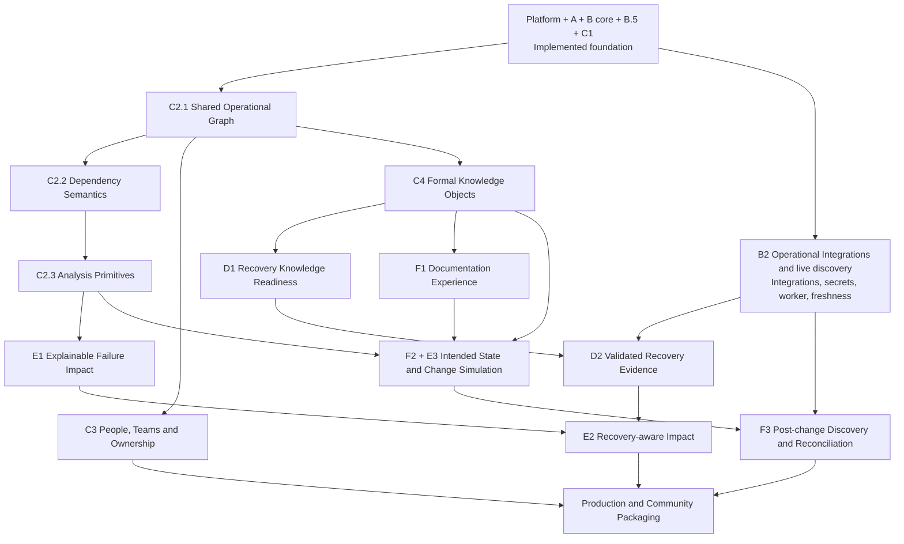
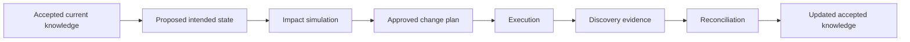

# Atlas development roadmap

Planning baseline: 30 August 2026

## Purpose

This document is the canonical forward-looking roadmap for Atlas. It enhances,
rather than replaces, the release structure already established in the
repository.

The roadmap and the implementation ledger serve different purposes:

- [`feature-ledger.md`](feature-ledger.md) records what is implemented at the
  audited commit named in that document.
- This roadmap records what should be delivered next, the dependencies between
  releases, and the product outcomes each release enables.
- [`mvp-brief.md`](mvp-brief.md) remains the historical brief for the completed
  foundation through Release C1.

A roadmap status must not be treated as implementation evidence. When a release
is delivered, the feature ledger should be re-audited against a named commit.

## Product direction

Atlas should evolve from a secure infrastructure and Service knowledge platform
into an explainable operations platform that can answer four increasingly
valuable questions:

1. **What exists, and what does Atlas know about it?**
2. **What provides each Service and Business Function?**
3. **What would be affected if an Asset, Service, or dependency failed?**
4. **What would change if a proposed future state were implemented?**

The next releases should not create separate graph logic for the homepage,
Service Operations, Impact Analysis, and Change Simulation. They should build a
shared, API-owned operational graph and analysis foundation that each product
view consumes.

For the immediate development period, Atlas will deliberately rely on manually
entered and curated accepted knowledge. This is a product-validation strategy:
prove and refine the knowledge, Service, relationship, and graph models before
investing heavily in additional discovery plugins and worker orchestration.
Automatic discovery remains an important later capability, and observed
evidence remains distinct from accepted operational knowledge.

## Roadmap principles

1. **Preserve the current system of record.** PostgreSQL operational records
   remain canonical. Evidence, assertions, reconciliation, and knowledge gaps
   retain their current meanings.
2. **Derive graphs; do not create a second truth store.** The operational graph
   is a scoped projection of accepted records unless a later ADR explicitly
   changes that decision.
3. **Keep authorization server-side.** Every graph, count, path, summary, and
   export must apply the existing global/customer/site permission model.
4. **Make uncertainty visible.** Atlas must distinguish accepted, asserted,
   inferred, stale, incomplete, and unknown knowledge. It must not present an
   objective, note, or inferred relationship as live proof.
5. **Build one analysis engine.** Failure impact and planned-change impact should
   use the same graph and analysis primitives with different scenario inputs.
6. **Deliver progressively.** Early releases may show structural context and
   knowledge readiness before Atlas can prove live availability or recovery.
7. **Preserve compatibility.** Existing routes and UI journeys should remain
   usable while shared services replace duplicated implementation internally.
8. **Use additive migrations.** Existing Assets, Services, relationships,
   assertions, changes, gaps, and generated documents must survive upgrades.

## Repository-grounded current position

| Release area | Status | Roadmap interpretation |
| --- | --- | --- |
| Platform and inventory foundation | Implemented | Retain and harden; do not reopen the tenancy or authorization model for C2 |
| Release A — Knowledge Foundation | Implemented | Reuse evidence, assertions, accepted knowledge, and meaningful changes |
| Release B — Discovery and Reconciliation | Core simulation and reconciliation implemented; live operation partial | Complete Integration APIs, secrets, worker dispatch, scheduling, retries, and service identity as a parallel operational-evidence stream |
| Release B.5 — Knowledge Completeness | Implemented for Assets and Services | Extend later to Business Functions, ownership, recovery, documentation, and intended-state objects |
| Release C1 — Homelab Service MVP | Implemented | Preserve first-class Services, Business Functions, temporal dependencies, recovery fields, provenance, completeness, and focused graphs |
| Release C2 — shared graph and later analysis foundations | Planned; C1 provides focused precursors | Decompose into C2.1 shared graph, C2.2 dependency semantics, and C2.3 analysis primitives |
| Release C3 — People, Teams and structured ownership | Planned | Deliver structured accountability without discarding C1 text labels |
| Release C4 — formal Knowledge Objects | Planned | Create the reusable content model for runbooks, recovery procedures, change plans, validation, and intended state |
| Release D — Backup and Recovery | Planned | Split knowledge readiness from evidence-backed recoverability |
| Release E — full Impact Analysis | Planned; structural prerequisites exist | Deliver failure analysis, then recovery-aware analysis, then planned-change impact |
| Release F — Documentation and intended state | Partial foundation | Expose documents, model intended state, and reconcile actual state after change |
| Production and community packaging | Not established | Treat security, migration, observability, packaging, and operator experience as an explicit release stream |

## Sequencing decision

The repository audit identifies **B2 — Operational Integrations and live
discovery** as an incomplete end-to-end product journey. It remains visible as
a parallel workstream, but the immediate product strategy intentionally
postpones heavy automatic-discovery and worker-orchestration investment.

The next development increment is **C2.1 — Shared Operational Graph** so that
the knowledge and Service models can be validated using human-entered accepted
data and future product views can share one graph foundation. B2 is not a
dependency or gate for C2.1.

Atlas must not make live availability, freshness, or recovery claims until the
relevant B2 and later recovery-evidence capabilities exist.

## Dependency view

C3 and C4 can begin after C2.1 contracts stabilize. B2 work can
proceed in parallel because it uses the existing worker and plugin boundary, but
it must not bypass the API-owned authorization and scope model.

# Release C2 — deeper graph and impact foundations

Release C2 turns the current focused graph endpoints into a reusable foundation.
It does not itself deliver every Impact Analysis or Change Simulation workflow.

## C2.1 — Shared Operational Graph

**Status:** next planned increment

**Outcome:** Atlas has one server-side graph projection service that represents
accepted Assets, Asset relationships, Services, Service dependencies, and
Business Functions within the caller's authorized scope.

C2.1 should:

- introduce stable typed node and edge contracts;
- derive graph data from existing relational operational records;
- keep semantic edge direction and managed relationship labels;
- include only links valid at request time, using each temporal source's
  `valid_from`/`valid_to` contract;
- include useful operational metadata such as lifecycle, operational state,
  criticality, completeness status, source, and timestamps where available;
- provide deterministic ordering, deduplication, cycle-safe projection, bounded
  depth, and explicit truncation warnings;
- expose a generic focused graph API;
- refactor the existing Service and Business Function graph routes to use the
  shared builder while preserving their response contracts initially; and
- establish reusable web graph normalization and presentation components.

C2.1 must not:

- introduce a graph database;
- write a second copy of accepted operational knowledge;
- calculate outage propagation, recovery estimates, or business impact;
- assign a synthetic global confidence percentage;
- treat raw source-current assertions as accepted operational state; or
- implement hypothetical scenario mutations.

Historical point-in-time graph projection is a later feature. C2.1 may use a
single internally captured request time for deterministic membership, but it
does not expose a caller-selected historical `as_of` query.

Detailed scope is in [`release-c2-plan.md`](release-c2-plan.md), architecture is
in [`../architecture/operational-graph.md`](../architecture/operational-graph.md),
and the governing decision is
[`../decisions/0001-shared-operational-graph.md`](../decisions/0001-shared-operational-graph.md).

## C2.2 — Dependency Semantics

**Outcome:** Atlas can describe how a dependency affects operation, including
redundancy and quorum, rather than relying only on a single
`required_for_operation` boolean.

Proposed capabilities:

- dependency groups or sets;
- evaluation strategies such as `all`, `any`, and `minimum`;
- `minimum_available` or quorum values;
- failure effects such as `unavailable`, `degraded`, `warning`, and `manual`;
- optional versus required dependencies;
- ordered or weighted recovery preferences where justified;
- explicit unknown semantics when a relationship is structural but its
  operational effect has not been classified; and
- additive migration of current C1 dependencies into a safe default meaning.

C2.2 should preserve the current dependency rows and history. New semantics
should be additive and visible in completeness so an unclassified critical edge
can become a knowledge gap rather than an invented conclusion.

## C2.3 — Analysis Primitives

**Outcome:** Atlas can safely traverse the operational graph and explain paths
without yet requiring every final product workflow.

Capabilities should include:

- bounded recursive traversal;
- deterministic cycle handling;
- incoming and outgoing path discovery;
- dependency-set evaluation;
- unavailable, degraded, potentially affected, unknown, and unaffected result
  states;
- reason codes and path explanations;
- confidence qualification based on evidence, accepted assertions, freshness,
  completeness, and unknown semantics;
- explicit limits and truncation handling;
- immutable analysis result contracts; and
- tests for redundancy, quorum, cycles, stale knowledge, missing knowledge, and
  authorization isolation.

At the end of C2, Atlas should be able to explain known structural and
operational paths. The dedicated Impact Analysis product workflow remains
Release E.

# Release C3 — People, Teams and structured ownership

**Outcome:** Atlas records accountable people and teams as structured entities
while retaining C1 text labels for compatibility and migration evidence.

Initial scope should include:

- Person and Team records;
- Team membership;
- role-based ownership assignments such as business owner, Service owner,
  technical owner, support team, recovery owner, change owner, and escalation
  contact;
- customer/site scope and authorization;
- active/inactive lifecycle;
- migration or deliberate association from existing `owner_name`,
  `technical_contact`, `support_group`, and Business Function owner labels;
- completeness rules for required ownership; and
- ownership display in Service Operations, recommendations, impact reports, and
  change plans.

C3 should not silently delete or reinterpret existing labels. They remain useful
for installations that do not need a formal people directory.

# Release C4 — formal Knowledge Objects

**Outcome:** Atlas has a reusable, versioned content model rather than creating
separate document mechanisms for Services, recovery, changes, and intended
state.

Candidate Knowledge Object types include:

- Service description;
- architecture document;
- operational runbook;
- backup policy;
- recovery procedure;
- validation procedure;
- change plan;
- rollback plan;
- intended-state definition;
- decision record;
- evidence record;
- known issue; and
- support procedure.

Knowledge Objects should support:

- customer/site ownership;
- type, title, status, version, and lifecycle;
- structured or Markdown content;
- links to Assets, Services, Business Functions, People, Teams, scenarios, and
  evidence;
- owner and approver assignments when C3 exists;
- source and provenance;
- last verified time;
- completeness requirements; and
- non-destructive supersession and history.

The existing generated `Document` rows should be integrated deliberately. C4
must not discard generated Markdown or misrepresent it as a reviewed runbook.

# Release D — Backup and Recovery

Release D should be split so Atlas can deliver honest early value without
claiming unproven recoverability.

## D1 — Recovery Knowledge Readiness

**Outcome:** Atlas can determine whether sufficient recovery knowledge exists.

A Service assessment may consider:

- RTO and RPO present;
- backup policy or notes present;
- recovery procedure present;
- recovery target identified;
- required dependencies modelled;
- accountable recovery owner assigned;
- validation instructions present;
- knowledge is sufficiently current; and
- no unresolved critical recovery knowledge gaps exist.

The user-facing term should be **Recovery knowledge readiness** or similarly
qualified. It must not be labelled proof that a restore will succeed.

## D2 — Validated Recovery Evidence

**Outcome:** Atlas can distinguish documented, observed, validated, and tested
recovery paths.

Capabilities may include:

- protection policies;
- backup execution evidence;
- backup success and failure history;
- recovery targets and eligibility;
- recovery procedures and steps;
- recovery test records;
- last successful restore;
- observed or tested recovery duration;
- evidence freshness; and
- path selection with an explanation.

Exact restoration estimates and claims such as “within RTO” require evidence.
An RTO is an objective, not an estimated duration.

D2 depends on the live Release B stream for trustworthy operational evidence.

# Release E — Impact Analysis

## E1 — Explainable Failure Impact

**Outcome:** A user can select an Asset or Service, apply a hypothetical
unavailable or degraded state, and receive an explainable blast-radius result.

The workflow should:

1. resolve the selected entity inside the caller's scope;
2. load the accepted graph at an analysis time;
3. apply a temporary failure state without mutating operational data;
4. evaluate dependency semantics;
5. identify directly and indirectly affected Assets, Services, and Business
   Functions;
6. classify results as unavailable, degraded, potentially affected, unknown, or
   unaffected;
7. show each reasoning path, evidence basis, and knowledge limitation; and
8. optionally persist an immutable analysis result.

E1 delivers the dedicated Impact Analysis screen but does not require validated
recovery evidence.

## E2 — Recovery-aware Impact Analysis

**Outcome:** Impact results include qualified recovery options.

Once D2 exists, the result may show:

- recovery objective;
- documented and validated procedures;
- eligible recovery targets;
- evidence freshness;
- observed or estimated duration basis;
- recovery gaps; and
- a recommended path with explicit decision reasons.

Atlas must show `unknown` when evidence does not support a conclusion.

## E3 — Planned Change Impact

E3 is delivered jointly with F2 because planned-change analysis requires an
intended-state overlay.

Initial scenario types may include:

- replace an Asset;
- move a workload;
- remove or disable a relationship;
- add an alternate dependency;
- change a storage or network path; and
- take an Asset or Service offline for maintenance.

Failure Impact and Change Impact should use the same analysis engine. The
scenario mutation is different; the graph and reasoning rules are shared.

# Release F — Documentation and intended state

## F1 — Documentation Experience

**Outcome:** Users can browse, create, link, version, and verify Knowledge
Objects through Atlas.

F1 may be delivered independently as a contained product increment because the
repository already contains deterministic Asset Markdown generation and
`Document` persistence. It is not a prerequisite for C2.1.

The product should expose generated documents without confusing generated facts
with approved human knowledge. Service, Asset, Business Function, recovery, and
change views should link to the same object model.

## F2 — Intended State and Change Simulation

**Outcome:** Atlas represents a proposed future state separately from accepted
current knowledge and uses it as an overlay for E3 analysis.

The change lifecycle should include:

- draft scenario;
- proposed graph mutations;
- before-and-after comparison;
- impact analysis;
- assumptions and unknowns;
- implementation steps;
- validation checks;
- rollback steps;
- owner and target window;
- approval state; and
- immutable analysis run metadata.

A draft or simulated scenario must never update operational Assets,
relationships, Services, or accepted assertions.

## F3 — Post-change Discovery and Reconciliation

**Outcome:** Atlas closes the loop between intended and observed state.

After execution, Atlas should compare new discovery evidence with the intended
state, create reconciliation items for differences, and preserve the original
plan and analysis for audit and learning.

# B2 — Operational Integrations and live discovery

The following capabilities remain necessary for trustworthy operational claims
and remain tracked as a parallel incomplete workstream. They are deliberately
outside the immediate manual-first C2.1 period:

- Integration CRUD and test-connection APIs;
- secret-reference resolution;
- explicit worker/service identity;
- API-authorized queued job envelopes;
- Redis-backed dispatch, retries, cancellation, and status;
- scheduled and on-demand discovery;
- source freshness and stale-run handling;
- operational telemetry or monitoring adapters where required; and
- secure logs and evidence retention.

The worker and plugins must not select a tenant, accept unvalidated ownership,
or bypass reconciliation.

# Foundation hardening backlog

These repository-grounded improvements do not change the implementation status
of Releases A through C1 and may be delivered independently of the principal
roadmap sequence:

- complete the Interface-first IP experience by using primary Interface and
  Network records consistently in Asset create, edit, list, filtering, and
  sorting journeys; retain `Asset.ip_address` only for migration and read
  compatibility until a deliberate deprecation decision is made;
- replace the mock Integrations page through B2 rather than treating the current
  scaffolding as a complete product journey;
- expose the existing generated Asset Markdown through F1; and
- preserve legacy Service-type Assets without automatic conversion until a
  deliberate association or migration workflow is designed.

# Product views are cross-release surfaces

The concept screens are not four replacement releases. They are product views
that become richer as roadmap capabilities arrive.

| Product view | Initial foundation | Later enrichment |
| --- | --- | --- |
| Homepage | A, B, B.5, C1 for inventory, changes, reconciliation, Service counts, and knowledge gaps | C2 concentration and environment graph; C3 ownership; C4 documentation; D recovery readiness; E risk recommendations; F planned changes |
| Service Operations | C1 Service model and focused graph | C2 shared graph; C3 ownership; C4 Knowledge Objects; D recovery; E failure analysis; F intended state |
| Impact Analysis | C2 graph and analysis primitives | D2 recovery options and evidence; C3 accountable owners; C4 linked procedures |
| Change Impact | C2 graph; E analysis engine | C3 owner; C4 change/validation objects; F2 intended-state overlay; F3 post-change reconciliation |

## Homepage metric rules

Every homepage metric should have:

- a documented formula;
- a visible denominator;
- a calculation time;
- a drill-down to source entities;
- explicit handling of unknown and stale data; and
- terminology that matches the evidence actually held.

Examples:

- Do not say an Asset is “responding” unless a monitoring or discovery source
  has supplied an appropriate current signal.
- Do not say a Service is recoverable merely because RTO/RPO and notes exist.
- Do not derive an estimated restoration duration from the RTO.
- Keep accepted knowledge changes, reconciliation review, and planned changes as
  separate activities.

# Recommended delivery sequence

1. **C2.1 — Shared Operational Graph.**
2. Keep **B2 — Operational Integrations and live discovery** visible as a
   parallel incomplete workstream without treating it as a C2.1 prerequisite
   or expanding the C2.1 branch scope.
3. **C2.2 — Dependency Semantics.**
4. **C2.3 — Analysis Primitives.**
5. Begin **C3** and **C4** once C2.1 contracts are stable; they may proceed in
   parallel with C2.2/C2.3.
6. Deliver the first enhanced **Service Operations** and **Homepage** surfaces
   using defensible existing metrics.
7. Deliver **E1 — Explainable Failure Impact**.
8. Deliver **D1 — Recovery Knowledge Readiness**. Deliver **F1 — Documentation**
   when useful; it is a contained independent opportunity and need not wait for
   this point.
9. Complete the B2 capabilities required for current operational evidence.
10. Deliver **D2** and **E2**.
11. Deliver **F2/E3 — Intended State and Change Simulation**.
12. Deliver **F3 — Post-change Discovery and Reconciliation**.
13. Complete formal production and community release packaging.

# Release gates

## Architecture and data

- The relational operational model remains the source of truth unless a new ADR
  is accepted.
- Migrations are additive and tested against existing data.
- Temporal records preserve history.
- Hypothetical scenarios do not mutate accepted operational data.

## Security

- No graph, count, path, recommendation, analysis, export, or scenario discloses
  inaccessible entities or their existence.
- Direct-ID, query, body, context-header, and relationship-endpoint substitution
  are tested.
- The API remains authoritative for scope and conclusions.

## Explainability

Every impact or recommendation result identifies:

- the affected entity;
- the rule or path used;
- the relationship semantics;
- the evidence or accepted assertion basis;
- confidence or uncertainty;
- relevant knowledge gaps; and
- the analysis time and engine/schema version when persisted.

## Quality

- Existing API, web, plugin, migration, and production-build checks pass.
- New contracts have focused unit and integration coverage.
- Cycles, redundancy, quorum, truncation, stale evidence, missing knowledge, and
  historical relationships are covered where applicable.
- Documentation and the feature ledger are updated without overstating live
  validation.

## Product integrity

- UI calculations do not independently decide impact, severity, confidence, or
  readiness.
- Percentages show their denominator and treatment of unknown values.
- Planned features remain hidden or explicitly labelled until usable.
- Recommendations are deterministic and explainable before optional AI-assisted
  wording is considered.

# Production and community packaging

Packaging is a separate release concern, not an assumption attached to feature
completion. It should include:

- supported deployment and upgrade paths;
- backup and restore guidance;
- stable configuration contracts;
- secure secret handling;
- health, logs, metrics, and troubleshooting;
- release notes and migration notes;
- sample data and guided first-run setup;
- documented limitations;
- dependency and container security review;
- licensing and contribution guidance; and
- repeatable release artifacts.

SSO/MFA, external append-only audit export, worker hardening, and security review
remain important production-readiness work even when they do not block C2.1.

# Deferred or later product areas

Unless separately reprioritized, the following remain later work:

- full ITSM incident, problem, change, and SLA/SLO management;
- enterprise service catalog and request fulfilment;
- billing or commercial tenancy above an Atlas instance;
- arbitrary per-record authorization policy;
- customer-specific type-definition tenancy;
- AI-generated remediation without deterministic evidence and approval; and
- replacing the relational model with a graph database solely for convenience.
